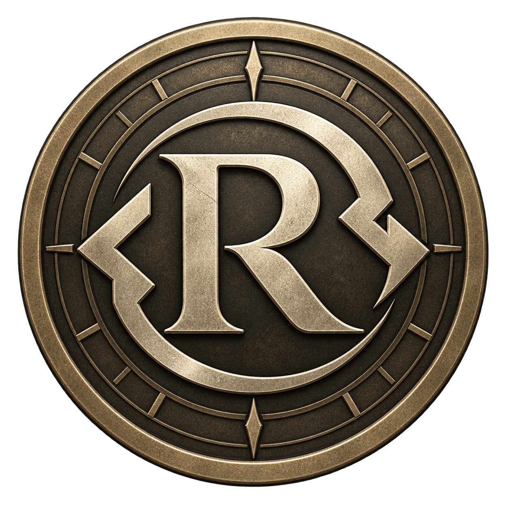
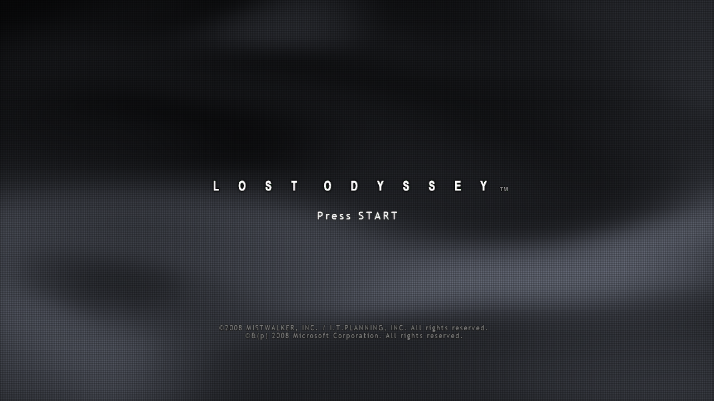
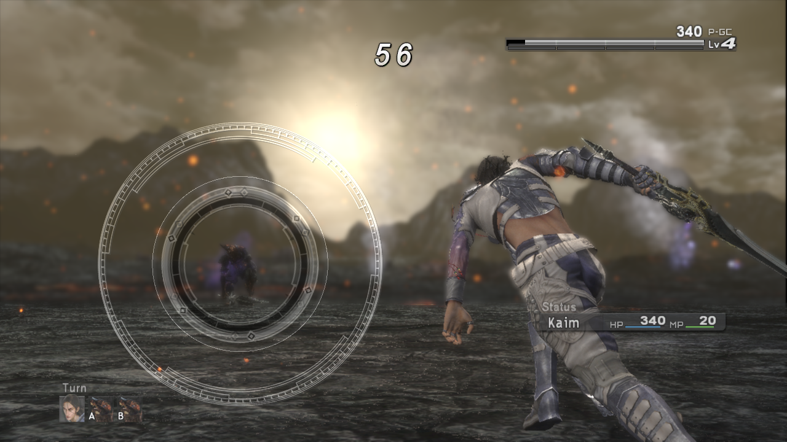
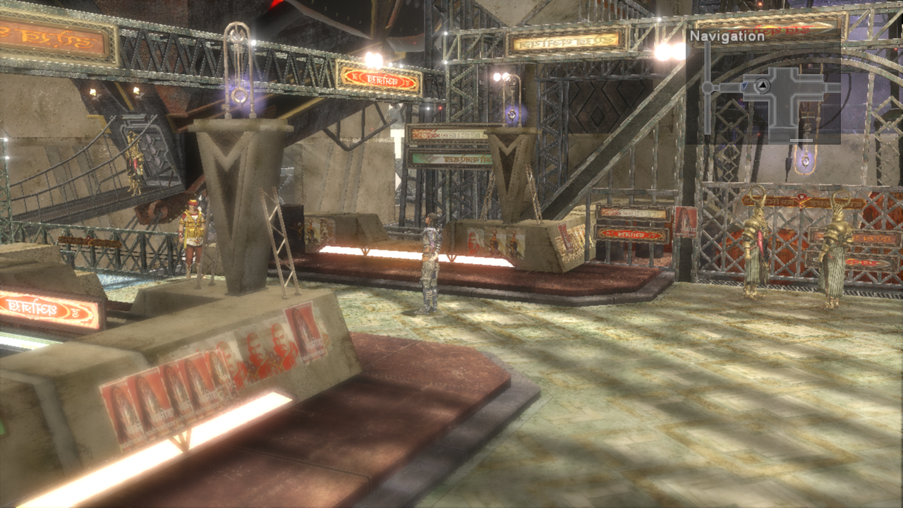

<div align="center">



# Lost Odyssey Recomp

**A native port of Lost Odyssey for Xbox 360.**

[](https://github.com/freefrank/LostOdysseyRecomp/releases/latest)
[](https://github.com/freefrank/LostOdysseyRecomp/releases)
[](https://github.com/freefrank/LostOdysseyRecomp/stargazers)
[](LICENSE)
[](https://github.com/freefrank/LostOdysseyRecomp/commits/main)
[](https://github.com/freefrank/LostOdysseyRecomp/issues)
[](https://ko-fi.com/dotslash)
[](https://discord.gg/z2yPct6z2w)


### [Download](https://github.com/freefrank/LostOdysseyRecomp/releases/latest) · [Installation guide](docs/INSTALLING.md) · [简体中文](README.zh-CN.md)

[Changelog](CHANGELOG.md) · [Report an issue](https://github.com/freefrank/LostOdysseyRecomp/issues) · [Discord](https://discord.gg/z2yPct6z2w) · [Project board](https://github.com/users/freefrank/projects/3) · [Build from source](docs/BUILDING.md)

</div>

## Start playing

Download the package for your platform from the [latest release](https://github.com/freefrank/LostOdysseyRecomp/releases/latest).

| Platform | Package | First launch |
| :--- | :--- | :--- |
| Windows x64 | `LostOdysseyRecomp-windows-x64-<version>.zip` | Extract the whole ZIP to a writable folder and run `LostOdysseyRecomp.exe`. Needs a CPU with AVX. |
| Linux x64 | `LostOdysseyRecomp-linux-x64-<version>.AppImage` | Make it executable with `chmod +x`, then run it. |
| Linux x64 | `LostOdysseyRecomp-linux-x64-<version>.flatpak` | Install the Freedesktop 26.08 runtime, then the bundle ([commands](docs/INSTALLING.md#flatpak)). |
| macOS arm64 | `LostOdysseyRecomp-macos-arm64-<version>.dmg` | Drag `LostOdysseyRecomp.app` to Applications. Needs an Apple Silicon Mac with macOS 15 or later. |
| Android arm64 | `LostOdysseyRecomp-android-arm64-<version>.apk` | Install the APK and open it once. Needs a 64-bit Android 8.0+ device with Vulkan. |

1. **Import your game data.** The importer opens when no game is found. Select an extracted game folder, `default.xex`, an ISO or GOD data.
2. **Get the shaders.** On the first start the game offers precompiled shaders for your renderer; if you skip, it compiles them once.
3. **Add the other discs and DLC** in Settings → **System → Import discs & DLC**. With all four discs imported, the game changes discs on its own.

Disc 1 is required to start. Use one supported four-disc set (Asian multilingual or USA/Europe) and don't mix editions; the [installation guide](docs/INSTALLING.md) shows how to check yours.

### macOS

The app is not notarized, so macOS blocks the first launch: try to open it once, then choose **Open Anyway** in **System Settings → Privacy & Security**. To update, replace the app with the new one. [Step-by-step guide](docs/INSTALLING.md#macos).

### Android

- **Game data:** opening the app creates `Android/data/io.github.freefrank.lostodyssey/files/game/`. Copy your extracted `disc1`–`disc4` into it over USB, or import disc images with **Game folder → Import disc images…**. **CTRL → Game folder** can point the game at another folder or an SD card.
- **Qualcomm devices:** the **GPU driver** page opens before the first start. Download a Turnip driver there.
- **Controls:** the touch controls hide when a controller is connected. **CTRL** sets their size, opacity and layout.
- **Updates:** a new APK installs over the old one and keeps your saves.
- **Saves:** **CTRL → Saves** exports saves to a ZIP and imports ZIPs from a PC, Xenia or the RGH save converter.
- **Logs:** they are in `Android/data/io.github.freefrank.lostodyssey/files/logs/` ([how to get them](docs/INSTALLING.md#android-logs)).

[Step-by-step guide](docs/INSTALLING.md#android).

### HDR

Turn on **HDR** in Graphics and save. **HDR peak brightness** opens a calibration page; **LB / RB** switch between the game scene and a test pattern. HDR is available on Windows, Linux and macOS.

## Features

| Feature | What you get |
| :--- | :--- |
| Import | Folder, XEX, ISO and GOD sources, DLC and disc replacement. Your original files are not changed. |
| Languages | Menus in English, Japanese, Korean, Traditional Chinese and Simplified Chinese. Game languages depend on your edition. |
| Display | Windowed or fullscreen, monitor and GPU choice, 16:9 and 21:9 resolutions (taller screens such as 16:10 are filled), [HDR](#hdr) and **Brightness / Gamma**. |
| Anti-aliasing and upscaling | FXAA, SMAA, TAA, DLSS, FSR 3.1, XeSS (Windows Direct3D 12) and MetalFX (macOS). |
| Graphics options | Shadow resolution 1×/2×/4×, SSAO/GTAO, anisotropic filtering, depth of field and bloom. |
| Frame rate | 30/60/90/120 FPS and FreeSync / G-SYNC Compatible VRR. |
| Frame generation | DLSS, FSR or XeSS on Windows Direct3D 12; DLSS on Windows Vulkan. |
| Shaders | Precompiled shaders downloaded on the first start, or compiled once and cached. |
| Audio | Stereo or 5.1 surround. |
| Input | Controllers, keyboard and rumble; touch controls on Android. |
| Mods | Texture, menu and font replacements and PlayStation button prompts. See the [modding guide](docs/wiki/Modding.md). |
| Debug menu | Render captures, Save Anywhere, encounter switches, teleport, fast-forward and cheats. See [Debug menu](#debug-menu). |

## Controls

Controllers and the keyboard work together for player 1. If your controller is not recognized, see the [input reference](docs/notes/controller-input.md).

| Game action | Keyboard |
| :--- | :--- |
| Start / Back | Enter / Backspace |
| A / B / X / Y | Z / X / A / S |
| D-pad / left stick | Arrow keys / I, J, K, L |
| Left / right shoulder | Q / W |
| Left / right trigger | E / R |
| Debug Menu | F1 |

Press **Back** to zoom the minimap; hold it for about half a second to hide the minimap. For Ring actions, use the controller's **right trigger** or **R**. **Vibration** in Settings sets the rumble strength.

## Debug menu

Press **F1**, or **LB+RB** on a controller (**L1+R1** on PlayStation layouts), to open or close the Debug Menu. The game pauses while it is open. It has three pages, **Overview**, **Teleport** and **Cheats**, and uses the keyboard or a controller.

| Action | Keyboard | Controller |
| :--- | :--- | :--- |
| Select a row | ↑ / ↓ | D-pad up / down |
| Change a value | ← / → | D-pad left / right |
| Confirm | Enter | A |
| Return or close | Esc | B |
| Previous / next page | Q or Tab / E | LB / RB |
| Change Cheats category | Select the category row, then ← / → | LT / RT |
| Open or close the overlay | F1 | LB+RB |

### Overview: captures and game actions

**Overview** shows the current map and has the menu language, **Capture render state**, **Save Anywhere**, **No Random Encounters**, **Encounter Every Step** and an action that wins the current battle.

- **Capture render state:** confirm it, then close the menu. The archive is saved in `captures/` with screenshots, rendering data and logs; look through it before sharing.
- **Save Anywhere** turns on the game's own **System → Save**.
- **No Random Encounters** stops random battles in the field; story battles still happen. **Encounter Every Step** starts a random battle on every step.

### Teleport: positions within the current map

**Teleport** has a position bookmark, editable X/Y/Z coordinates and the map's points of interest. On the coordinate row, press **Enter** to pick X, Y or Z and **←/→** to move it. Confirm, then close the menu to move.

**Debug Event Room**, at the bottom of the page, takes you to the game's own event-debug map (z0g_9). Hold **LB** and press **Up** there to open Scenario Jump.

### Cheats: speed and game-data tools

| Category | What it does |
| :--- | :--- |
| **Quick tools** | Fast-forward, **Allow memory edits**, gold and HP/MP. |
| **Characters** | HP/MP, EXP (0–99, not the level) and skills. |
| **Inventory** | Set items and materials to 1, 10, 50 or 99, or fill whole categories. Sort the in-game inventory to refresh it. |
| **Equipment** | Weapon, ring and accessory changes. |
| **Party** | Party members, rows and field character. |
| **Developer** | The original **EDIT MENU**: enable it, close F1, press **LT+RT**. |

**Fast-forward** runs at 2×–8× while you hold **LT** (**Hold**) or after you press it (**Toggle**).

**Memory edits** are off by default. Back up your save, turn on **Allow memory edits**, choose an action, confirm **Yes** and close F1 to apply it.

## Files and folders

The Windows ZIP is **portable**: everything stays in the folder you extracted it to. The AppImage, Flatpak and macOS app keep your files in your user folders:

| Package | Settings | Saves, cache and game data | Logs |
| :--- | :--- | :--- | :--- |
| Windows ZIP | folder with `LostOdysseyRecomp.exe` | same | same |
| Linux AppImage | `~/.config/lost-odyssey-recomp/` | `~/.local/share/lost-odyssey-recomp/` | `~/.local/state/lost-odyssey-recomp/` |
| Linux Flatpak | `~/.var/app/io.github.freefrank.LostOdysseyRecomp/config/lost-odyssey-recomp/` | `~/.var/app/io.github.freefrank.LostOdysseyRecomp/data/` | `~/.var/app/io.github.freefrank.LostOdysseyRecomp/.local/state/lost-odyssey-recomp/` |
| macOS app | `~/Library/Application Support/LostOdysseyRecomp/` | same | `~/Library/Logs/LostOdysseyRecomp/` |
| Android | inside the app | inside the app; game data in `Android/data/io.github.freefrank.lostodyssey/files/game/` | `Android/data/io.github.freefrank.lostodyssey/files/logs/` |

| What | Where | Notes |
| :--- | :--- | :--- |
| Saves | `save/` | Keep when updating. Xenia and Xbox 360 saves can be [imported](docs/INSTALLING.md#importing-saves). |
| Profiles | `profile/` | Keep when updating. |
| Settings | `settings.ini` | Delete it to go back to the default settings. |
| Imported game | `game/` with `disc1/`–`disc4/` and `dlc/` | The importer's default location; `game-path.txt` remembers another one. |
| Shader cache | `cache/shaders/` | Rebuilt if deleted. |
| Downloaded shaders | `shaders/` | |
| Logs | `logs/runtime-*.log` | The last three runs are kept. |
| Render captures | `captures/` | |
| Mods | `mods/` | |

More detail is in [file locations](docs/INSTALLING.md#file-locations).

## Command-line options

| Option | Effect |
| :--- | :--- |
| `--game <path>` | Use this game folder (with `default.xex` or `disc1/`) or `default.xex` file, skipping the importer. |
| `--install` | Open the importer even when a game is already set up. |
| `--setup` | Windows: run the first-launch setup again, then start the game. |
| `--prepare-shaders-only` | Prepare all shaders, then exit without starting the game. |

```bash
LostOdysseyRecomp.exe --game "D:\Games\Lost Odyssey"
./LostOdysseyRecomp-linux-x64-<version>.AppImage --game ~/Games/LostOdyssey
flatpak run io.github.freefrank.LostOdysseyRecomp --game ~/Games/LostOdyssey
```

| Environment variable | Effect |
| :--- | :--- |
| `LO_GRAPHICS_API` | `d3d12` or `vulkan` on Windows. |
| `LO_FPS` | Frame-rate cap; `0` means uncapped. |
| `LO_NO_UPDATE=1` | Skip the update check. |
| `LO_MODS=0` | Disable mods. |
| `LO_AUDIO_MUTE=1` | Mute audio. |
| `LO_CONTROLLER_RUMBLE=0` | Turn rumble off. |
| `LO_OPTISCALER_PATH` | Load your own `OptiScaler.dll` on Windows ([setup](docs/notes/vulkan-fg-fsr4-metalfx.md#optional-optiscaler-loading-on-windows)). |

## Reporting a problem

[Open an issue](https://github.com/freefrank/LostOdysseyRecomp/issues) with the version, operating system, graphics backend, GPU and driver, game edition and disc, and the steps or scene that show the problem. Attach the newest `logs/runtime-<timestamp>.log`.

For a visual problem, make a [render capture](#overview-captures-and-game-actions) while it is on screen. Do not attach game files, saves or personal data.

Optional diagnostics are off by default; see [Privacy](PRIVACY.md).

## Screenshots



| Ring combat | City exploration |
| :---: | :---: |
|  |  |

## Development

See [Building](docs/BUILDING.md), [Developer tools](tools/README.md), the [roadmap](docs/ROADMAP.md) and the [documentation index](docs/README.md).

## Sponsors

Thank you to **Frenzy Fresh**, **José Antonio Martínez Godoy**, **C_BAR**, **Arakon**, **Efren V**, **Torresmo**, **doc_haz**, **Whitesun** and **Cristian** for supporting the project on [Ko-fi](https://ko-fi.com/dotslash).

## Credits and game data

Thanks to everyone who sent pull requests and patches: [MikeRavenelle](https://github.com/MikeRavenelle), [dj5927](https://github.com/dj5927), [Xarishark](https://github.com/Xarishark), [navjack](https://github.com/navjack), [frankzzz](https://github.com/frankzzz) and [cngjd](https://github.com/cngjd). The macOS port started from MikeRavenelle's Apple Silicon work.

With research and tools from [UnleashedRecomp](https://github.com/hedge-dev/UnleashedRecomp), [re:Blue](https://github.com/zolaware/reblue), [XenonRecomp](https://github.com/hedge-dev/XenonRecomp), [XenosRecomp](https://github.com/hedge-dev/XenosRecomp), [plume](https://github.com/renderbag/plume) and [Xenia](https://github.com/xenia-project/xenia). Audio uses the [Xenia FFmpeg fork](https://github.com/xenia-project/FFmpeg) ([license](thirdparty/ffmpeg-LICENSE.txt)). The Android Turnip GPU drivers come from the driver list of the [Eden](https://git.eden-emu.dev/eden-emu/eden) emulator and load through [libadrenotools](https://github.com/bylaws/libadrenotools).

Lost Odyssey and its assets belong to their respective owners. This is an unofficial project. Supply data extracted from your own discs; do not commit game executables, resource archives, textures, audio, video, generated game code or captures to this repository. Dependencies retain their respective licenses.
