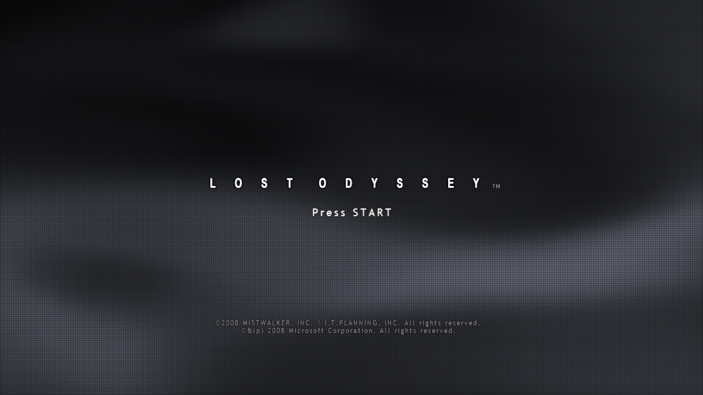
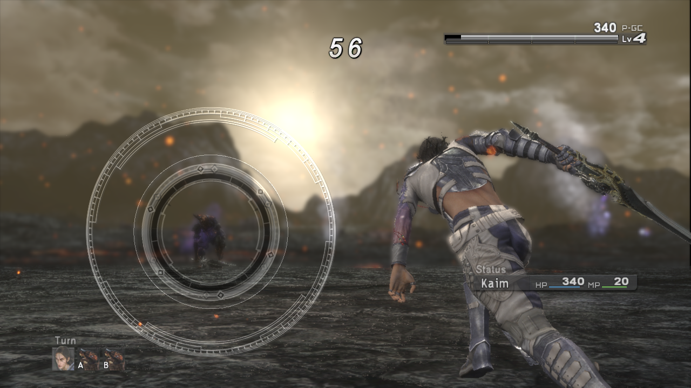
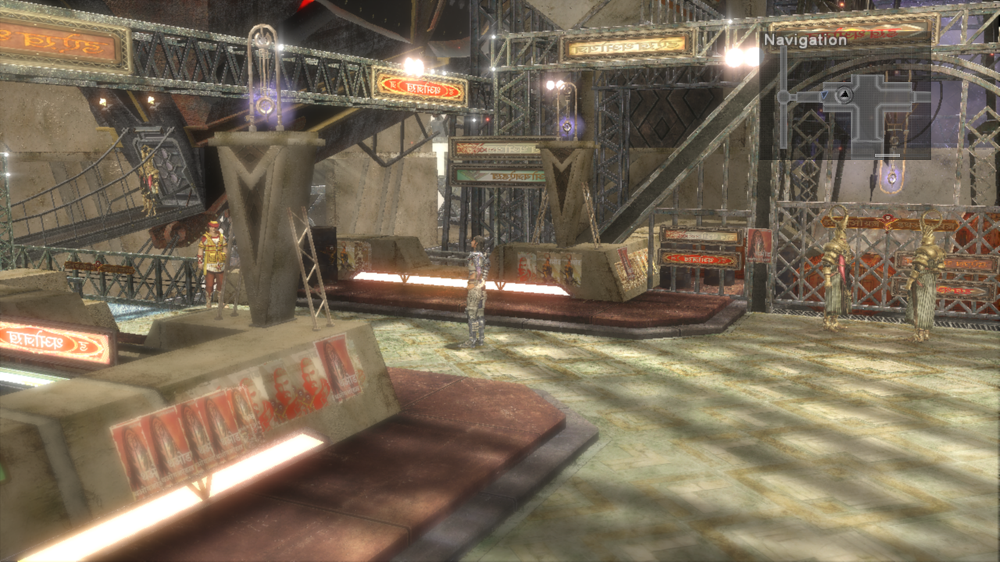

<div align="center">

# Lost Odyssey Recomp

**《失落的奥德赛》Xbox 360 版的实验性原生 PC 移植。**

Windows x64 · Direct3D 12 · Vulkan · PowerPC 静态重编译



可选 TAA 着色器收集会在首次设置，或已有玩家下次打开设置时询问同意。开启后向 `lo.dotslash.pro` 上传有限的着色器摘要，以及压缩的 32 帧稀疏相机运动／深度序列（含抖动与相机矩阵）；schema 2 摘要还可为未知顶点 shader 携带保守的位置证据，同时继续支持 schema 1 格式。可在设置 → 语言中关闭；不上传原始日志、本地路径、存档、彩色画面或着色器源码。异常 shader 摘要优先于低优先级的时序资料归档。参见[采集说明](tools/taa-collector/README.md)。

### [下载 v0.5.1-updaterfix](https://github.com/freefrank/LostOdysseyRecomp/releases/tag/v0.5.1-updaterfix) · [安装指南](docs/INSTALLING.md) · [反馈问题](https://github.com/freefrank/LostOdysseyRecomp/issues)

[English](README.md) · [项目状态](docs/STATUS.md) · [路线图](docs/ROADMAP.zh-CN.md) · [维护者 Project（公开）](https://github.com/users/freefrank/projects/3) · [从源码构建](docs/BUILDING.md)

</div>

> [!IMPORTANT]
> **本项目仍处于早期测试阶段。** 已测试开场区域和部分场景，尚未通关。渲染和稳定性仍有问题。请自行提供受支持版本的游戏文件。

## v0.5.1 更新

更新器支持独立双击启动，以及同数字版本的后缀更新判断。完整 Windows ZIP 和独立 updater EXE 均已发布；独立 EXE 需放在游戏程序和 `manifest.json` 同目录。

## 之前的 v0.4.2 更新

修复已复现的乌拉议会过场崩溃及另外九类 PowerPC 翻译错误，原生崩溃信息写入自动运行日志。补齐六条战斗 TAA 路径；敌人消散闪烁仍待修复。F1 捕获后在后台压缩 ZIP，成功保存后才清理对应原始目录；默认保留当前日志及最新两份旧日志，活动文件和自定义路径受保护。帧捕获本身仍可能暂停渲染。

已完成检查与剩余覆盖详见[更新日志](CHANGELOG.md)、[验证范围](docs/STATUS.md)和[议会调查](docs/notes/issue7-cutscene-crash.md)。

## v0.4.1 历史修复

v0.4.1 修复启用 TAA 时的 Map3 轮胎阴影闪烁，已获得原位置用户确认，并加入附带运行日志的三帧 F1 导出。

## v0.4.0 历史功能

提供最高 4K 的真实内部分辨率、SMAA 与实验性相机重投影 TAA、标准／高质量滤波、可保存的帧率控制，以及亚洲／美欧 CPX 自动索引。设置页文字按输出分辨率绘制，Debug 标签独立切换英文／简体中文。详见[更新日志](CHANGELOG.md)。更新后旧翻译着色器缓存会重建。

## v0.3.0 历史功能

v0.3.0已正式发布，扩大到压缩资源与XEX中的shader发现，生成有限顶点shader变体，并在后续启动预创建以前记录过的图形管线。首次扫描和编译可能需要数分钟，后续启动复用缓存。覆盖仍不完整，不代表消除所有卡顿。见[验证详情](docs/notes/shader-preparation.md)。

## v0.2.2 修复

修复已验证 AMD 场景中的全黑／偏黑与景深异常，以及 Windows Unicode 安装目录、启动参数和存档路径问题。NVIDIA RTX 5080 定向回归与用户视觉验收通过，正式包也已完成中文工作目录下的 Map 12 启动验证。Issue #4 在路径修复说明后关闭，但本机检查未复现其完整游戏崩溃，也没有后续报告者验收记录。见[当前 Issue 证据](docs/STATUS.md#live-issue-reconciliation)、[v0.2.2 发布说明](docs/notes/release-0.2.2.md)与[更新日志](CHANGELOG.md)。

## v0.2.1 新增功能

**v0.2.1 已发布。** 本版增加 F1 下一完整帧渲染捕获及自动 ZIP、多 SDL 已映射手柄与键盘同时可用，以及 E/R 扳机。捕获用于诊断，不是 AMD 修复。

## v0.2 新增功能

**v0.2 已发布。** 本版加入已核对的 USA, Europe 四盘版本、按版本提供的游戏及语音语言选项、先导入后首次设置，以及自动读取已导入盘。四盘全部导入后无需手动换盘。两版均已通过原版管理器受控换盘测试；章节交界剧情与完整通关仍未验证。详见 [v0.2 发布说明](docs/RELEASE-v0.2.md)。

## 开始游戏

1. **下载并完整解压** Windows 发布包，放在可写入的文件夹中。
2. **运行 `LostOdysseyRecomp.exe` 并按提示导入游戏文件**。支持已提取文件夹、`default.xex`、XDVDFS ISO 或 GOD 容器。
3. **选择语言和图形设置**，设置与着色器预编译完成后继续进入游戏。

发布包不需要安装 Python 或 Visual Studio。后续启动会复用着色器缓存；更新程序时请保留存档和档案文件夹。

v0.5.1 更新器会检查 GitHub 最新 Release。数字版本更高，或数字版本相同但后缀不同时触发更新。现有 v0.5.0 客户端可通过数字版本检查升级到此 Release。

将 `LostOdysseyUpdater.exe` 放在游戏程序和 `manifest.json` 同一目录，先关闭游戏再双击，即可手动检查更新。即使设置中关闭了自动检查，手动检查仍可使用；更新成功后会启动游戏。详见[独立更新器说明](docs/INSTALLING.md#standalone-updater)。

| 要求 | 支持范围 |
| :--- | :--- |
| 系统 | Windows x64、支持 AVX 的 CPU、Direct3D 12 或 Vulkan 图形驱动 |
| 游戏数据 | 已核对的 Europe, Asia 或 USA, Europe 版；启动需要 Disc 1 |
| 其他光盘 | 通过 `InstallGame.exe` 追加导入；后续光盘流程尚未完整验证 |

支持的光盘版本、文件位置和更新方式见[安装指南](docs/INSTALLING.md)。

## 实机画面

| Ring 战斗 | 城市探索 |
| :---: | :---: |
|  |  |

*截图来自 v0.1 发布前的开发构建，未经修图。*

## 当前功能

| 功能 | 说明 |
| :--- | :--- |
| 游戏导入器 | 支持文件夹、XEX、ISO 和 GOD；复制原始文件 |
| 首次启动设置 | 游戏初始化前选择语言和图形选项 |
| 语言设置 | 英语、日语、韩语、繁体中文、简体中文界面，以及游戏语言选择 |
| 图形设置 | 最高 4K 的 Auto／手动内部分辨率、Off／FXAA／SMAA／实验性 TAA、标准／高质量滤波、30／60 FPS 及输出／显示控制；全屏和跨 DPI 仍需更多测试 |
| 设置菜单素材 | 从已安装语言资源读取 Maru23／Abc 字体路径及原版灰色面板／齿轮素材；图形设置单击保存并应用，需要重启时选择 Now/Later，Back 直接返回上一级且不显示原版确认框 |
| 着色器预编译 | 内置资源索引、多线程编译、缓存复用 |
| CPU 使用率 | 减少不必要的 CPU 轮询；一个匹配的 D3D12 场景记录为 15.6% → 4.3%，两次采集均约 60 presents/s |
| 输入与调试 | 手柄和键盘输入；英文／简体中文 F1 菜单提供捕获、地图信息与同地图 POI 传送 |

DLSS、FSR 和帧生成尚未实现；v0.4.0 已移除此前的禁用控件。HDR 仍为后续工作。

**当前 v0.5.0 Windows 版 DLC：**打开 `InstallGame.exe`，选择 **Files** 或 **Folder**，导入器会自动识别游戏光盘和失落的奥德赛 STFS DLC。三份真实 DLC 包已完成导入，运行时共读取 header、完整索引和 payload 24 次且无崩溃；导入文件和用户数据保持不变。奖励和地下城玩法仍待验证。见[安装说明](docs/INSTALLING.md#automatic-content-import)。

**v0.5.0 开发记录：** 当时的源码和发布目标统一为 0.5.0；0.4.19–0.4.23 作为内部开发历史保留，不单独对应发布版本。当前 Windows 版提供 D3D12 与 Vulkan、游戏/DLC 自动识别、原版风格 Settings、图形设置单击保存并应用、Now/Later 重启选择、直接返回上一级且不显示原版确认框、shader cache 复用、减少不必要的 CPU 轮询。复用 shader 标识、优化几何准备和精确限帧后，固定 Map16 4K 的 RTSS 从 48.01 升至 59.76 FPS；其他场景及全游戏持续性能仍待验证。当前候选优先处理 capture 确认的异常 shader，并保留可选稀疏相机资料供后续时序研究；候选程序见[0.5.0 发布准备](docs/RELEASE-v0.5.0.md)，发布状态另行记录。当前 Windows 范围仍有界：其他 GPU 需要反馈，DX11/Linux/macOS/实验性 Switch（与 u/Adoky 合作）属于未来工作，DLC 奖励／地下城和完整游戏覆盖仍未验证。

v0.5.0 的交付范围为 Windows D3D12／Vulkan；DX11、Linux、macOS 及与 u/Adoky 合作的实验性 Switch 移植属于未来工作，其他 GPU 覆盖等待用户反馈。0.4.xx 保持内部开发版本。D3D12 CPU 对照仅适用于记录中的场景和硬件，不是全游戏或 Vulkan benchmark。全游戏兼容性及两项已知 shader failure 仍待完成。

## 验证与剩余工作

v0.4.1 Windows 正式包通过发布 CI、全部 45 项 manifest、安装器自测及 8 项启动路径检查。公开下载及校验和与已验证包一致。本轮正式包检查未加载游戏或重做 GPU 验证；Map3 TAA／Off 对照和玩家验收来自此前 r2 候选，其渲染代码在正式版中未变。

两个已核对版本此前均通过 v0.4.0 正式包的隔离 Map2 启动检查，Auto 1080p／TAA 及包内编译器依赖已核实。该限定静态场景检查不代表全游戏兼容。

TAA 仍为实验功能，缺少原生对象运动矢量，不支持的路径回退至 SMAA。60 FPS 已通过选定移动、对白和 Ring 核心计时检查，但未验证全游戏锁定 60 或精准 Ring 释放／Perfect。未验证的 120 FPS 选项需要 `LO_EXPERIMENTAL_120=1`，否则实际按 60 FPS 运行。

如果遇到 TAA 闪烁、拖影或缺少物体，请附上 `logs/runtime-<timestamp>.log` 的完整日志；问题出现时尽量使用 **F1 → Capture render state** 并上传生成的 ZIP。截图或视频可作为补充；如果捕获失败，请提交完整日志并说明情况。请通过 [GitHub Issues](https://github.com/freefrank/LostOdysseyRecomp/issues) 反馈，简述问题、复现步骤以及预期／实际行为。见 [bug report template](.github/ISSUE_TEMPLATE/bug_report.md)。

当前优先保证游戏流程和原版渲染行为。项目使用 **XenonRecomp** 将 PowerPC 代码翻译为 C++，在宿主侧实现 Xbox 360 服务，并通过 **plume** 渲染翻译后的 Xenos 着色器。

v0.2 发布包已通过 Windows 托管 CI、清单与导入器检查，以及 30 秒隔离渲染启动。地面投影及海报修复已有定向验证，用户已确认 RT 操作下的 Ring 判定正常。对白倍速问题已解决并经用户确认，修复在装甲车场景中通过了原始音轨对照。

**待修复问题：**火焰受击和箱子破坏特效、偶发 GPU 查询／等待故障。人物表面阴影、其他音频场景和更广泛的游戏流程属于回归覆盖。仍有两个已知着色器预编译失败项。上述结果不代表全游戏兼容。

[详细状态与验证证据](docs/STATUS.md) · [v0.2 发布说明](docs/RELEASE-v0.2.md)

<details>
<summary><strong>游戏版本与兼容性详情</strong></summary>

支持的两个版本对应 [Lost Odyssey (Europe, Asia) (En,Ja,Zh,Ko) (Disc 1)，Redump 39111](https://redump.info/disc/39111) 与 [Lost Odyssey (USA, Europe) (En,Ja,Fr,De,Es,It) (Disc 1)，Redump 11817](https://redump.info/disc/11817)。本文将前者简称亚洲版：Disc 1 的 Title ID 为 `4D5307FA`、Media ID 为 `39F7D748`、标题／基础版本为 `0.0.0.4`、XeMID 为 `MS204204H0X14`。USA, Europe 版 Disc 1 的 Media ID 为 `368DE6DD`、版本为 `0.0.0.3`、XeMID 为 `MS204203W0X14`。这些身份字段与已核对的两套数据一致；尚未进行整张 ISO 与 Redump 哈希的完整比对。导入器严格核对每盘受支持的 XEX 哈希，不能仅凭区域名称判断。

v0.2 已加入经核对的 **USA, Europe 0.0.0.3 四盘版本**，严格校验 XEX 并阻止不同版本混装。游戏语言按安装版本提供：USA, Europe 版为英／日／德／法／西／意，已核对的 Europe, Asia 资源保留英／日／韩／繁中／简中选项。Redump 的 Zh 标记本身不能证明所有零售盘均含简体中文；设置界面仍保留现有五种翻译。**此支持不包含在 v0.1 中。** 详见[USA, Europe 版支持与验证](docs/notes/europe-support.md)。

v0.2 在原游戏请求下一盘时自动读取已导入的对应盘，无需玩家点击换盘按钮。四盘全部导入后无需玩家手动换盘。两种已核对版本均通过存储测试及原版管理器 1 → 2 → 3 → 4 → 1 受控流程。章节交界剧情尚未验证，此功能不在 v0.1 中；详见[自动选盘证据](docs/notes/disc-selection.md)。

提供语言选项不代表每种语言都已通关验证。已核对集合之外的区域版本、Title Update 和修改后的 XEX 尚未验证，详见[版本证据](docs/notes/xex.md)。

</details>

<details>
<summary><strong>构建命令与仓库目录</strong></summary>

### 构建与运行

请按[构建指南](docs/BUILDING.md)准备自己的游戏数据、依赖及生成代码。辅助脚本自动查找工具，自定义安装位置可通过环境变量指定。

```powershell
.\tools\build_runtime.bat
$gameData = (Resolve-Path .\LostOdysseyRecompLib\private\disc1).Path
Push-Location .\out\build\windows-clang\LostOdysseyRecomp
.\LostOdysseyRecomp.exe --game $gameData --quiet-kernel
Pop-Location
```

保持启动工作目录一致，避免读到另一套存档或档案。

| 动作 | 键盘 |
| :--- | :--- |
| Start / Back | Enter / Backspace |
| A / B / X / Y | Z / X / A / S |
| 十字键 / 左摇杆 | 方向键 / I、J、K、L |
| 左 / 右肩键 | Q / W |
| 左 / 右扳机（v0.2.1） | E / R |
| 调试菜单 | F1 |

**v0.2.1 输入更新：**所有 SDL 已映射手柄与键盘可直接交替使用，无需选择当前设备。输入合并到玩家 1，不代表多人模式。热插拔及混合输入已通过 SDL 虚拟设备测试，实体型号和游戏中切换仍待验证；未映射摇杆需要 SDL 手柄映射。见[输入证据](docs/notes/controller-input.md)。

默认关闭震动，`LO_CONTROLLER_RUMBLE=1` 可开启。已发布 v0.2 的 Ring 使用手柄右扳机，v0.2.1 也可用 R 键输入 RT；肩键不等于扳机。

### 开发导航

| 目录 | 内容 |
| :--- | :--- |
| `LostOdysseyRecomp/` | 宿主内核、图形、音频、输入与调试 |
| `LostOdysseyRecompLib/` | 配置；Git 忽略的 `private/` 游戏数据和 `ppc/` 生成代码 |
| `tools/` | 重编译工具、依赖补丁、Ghidra 脚本 |
| `thirdparty/` | 渲染、音频及其他依赖 |
| `docs/` | 当前状态、指南、逆向记录与历史归档 |

[路线图](docs/ROADMAP.zh-CN.md) · [接手入口](docs/notes/handoff.md) · [渲染测试](docs/notes/rendering-validation.md) · [音频](docs/notes/audio-output.md) · [归档](docs/archive/README.md)

</details>

## 致谢与游戏数据

本项目参考 [UnleashedRecomp](https://github.com/hedge-dev/UnleashedRecomp)、[re:Blue](https://github.com/zolaware/reblue)、[XenonRecomp](https://github.com/hedge-dev/XenonRecomp)、[XenosRecomp](https://github.com/hedge-dev/XenosRecomp)、[plume](https://github.com/renderbag/plume) 和 [Xenia](https://github.com/xenia-project/xenia)。音频采用固定版本的 [Xenia FFmpeg 分支](https://github.com/xenia-project/FFmpeg)，已附[许可证](thirdparty/ffmpeg-LICENSE.txt)。

《失落的奥德赛》及其资产归各自权利人所有，本项目为非官方移植。请从自己拥有的光盘提取数据，不提交游戏程序、资源包、纹理、音视频、生成的游戏代码或捕获数据。依赖保留各自许可证。
