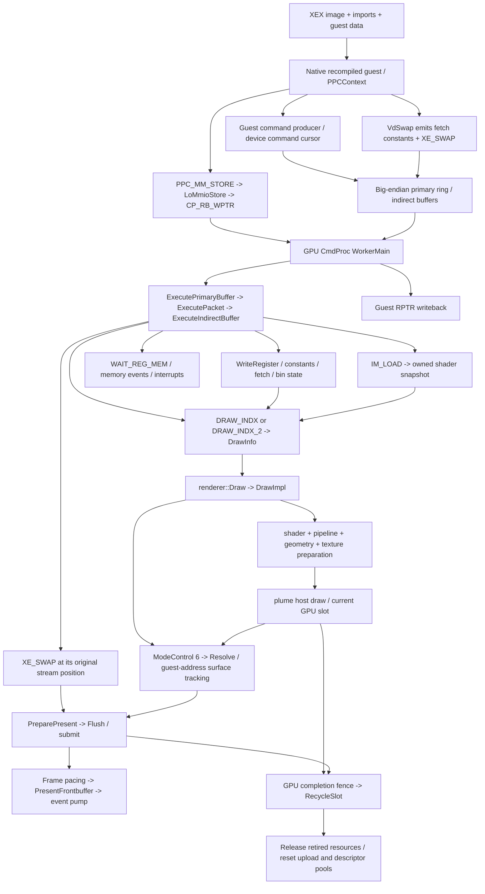
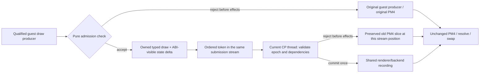

# 原生迁移架构边界与首个 PM4 旁路候选

研究日期：2026-09-28（America/Edmonton）
源码基线：`2ce27e35428d85abde20afb5b6b2c59052810b13`
关联 Project：`native-migration-architecture-boundaries`、`native-renderer-pm4-bypass-prototype`

## 交付状态

本次交付完成源码依赖图、XEX 消费者清单、首个历史 draw 的具体定位，以及后续原型的回退和对照协议。首个候选为标题画面的云雾背景层 `title-cloud-layer-v1`。

**运行时旁路尚未实现。** 当前版本的生产者到该 draw 的动态归属、同输入快照、A/B 画面、CPU/GPU 耗时和生命周期验证均未完成。候选清单中的 `qualified_for_bypass` 固定为 `false`；它是研究记录，不能直接作为运行时白名单。本次不改变默认渲染、guest 时序、XEX 加载或资源回收。

Project 中原有来源 `docs/notes/progressive-native-migration-plan.md` 在此源码基线不存在。本文件提供新的代码级记录，不把历史规划当作已实现功能。

## 1. 必须分别处理的七条边界

| 边界 | 当前实际依赖 | 单路径原型保留什么 |
|---|---|---|
| 1. CPU 指令执行 | `LostOdysseyRecompLib` 编译生成的 `ppc_recomp.*.cpp` 和函数映射表；guest 启动最终通过 `FindFunction` 调用 host 函数。 | 保留静态重编译执行。移除 PM4 不等于消除 PPC 语义和调用约定。[S1] [S2] |
| 2. guest ABI | `PPCContext`、r1 guest stack、r13 PCR/TLS/TEB、r3/r4 参数、返回寄存器、guest 函数地址及间接调用。 | wrapper 的参数、返回值、寄存器和 guest 对象写回须与原路径一致；禁止让 CP 线程回调原 guest 绘制函数充当回退。[S2] |
| 3. guest 内存布局 | 连续 guest 地址空间、`base + offset` 翻译、32 位 guest 指针、big-endian 数据和物理地址归一化。 | 地址不能直接升级为 host 指针；提交后读取的数据必须有快照或有效期明确的资源引用。[S3] [S5] |
| 4. XEX 容器与运行时数据 | `Image::ParseImage` 后将映像复制到原 guest image base；运行时修补 IAT、变量导入、模块句柄和 execution info。 | 首个原型不改 XEX。换成其他容器仍需提供等价映像和运行时数据，不能据此宣布 guest layout 已移除。[S4] |
| 5. PM4 命令传输与解释 | primary ring、递归 IB、WPTR/RPTR、包类型解码、寄存器写入、条件执行、事件和 swap。 | 保留队列顺序与所有未接管命令；只允许明确归属的一段 draw 命令事务参与旁路。[S5] [S6] |
| 6. Xenos 渲染语义 | shader microcode、常量/fetch 寄存器、几何与端序转换、EDRAM/resolve、纹理布局、viewport、blend/depth/stencil。 | 首次复用当前转换器、纹理/管线缓存和 renderer 资源所有权，避免同时重写 shader、纹理和提交层。[S7] [S8] |
| 7. 第三方派生代码与归属 | shader 翻译器明确记录 XenosRecomp 改编来源、Xenia 语义参照和 gamma 实现来源；构建还依赖 XenonUtils、plume 等。 | PM4 某条路径不再执行，不会自动消除这些源码依赖和来源记录；按真实被替换的组件逐项梳理。[S9] [S14] |

D3D12/Vulkan 是上述链路之后的 host backend。单路径原型仍使用现有 device、queue、command list、GPU slot 和 fence；不另建一套提交所有权，也不把 backend 切换与 guest ABI 迁移合并成一次实验。

### XEX 为什么不能只换包装

已核对的消费者包括：

- `main.cpp:352–378`：加载 `default.xex`，取得 entry，再启动 guest。
- `XexLoader::Load`：在 `s_imageBase` 复制映像；保留 `s_imageSize`、`s_entryPoint`；将函数 IAT 指向 hooked thunk，并为变量导入写入 guest 地址。
- `XexExecutableModuleHandle`：合成模块对象包含原 image base；`kernel/imports.cpp` 中模块句柄查询仍返回该 guest 对象。
- `XamGetExecutionId`：返回 `s_executionInfo` 指向的 guest 数据；时间戳、GPU 全局变量等也由 loader 合成。
- `NtQueryVirtualMemory` 所在的内存查询路径：仍使用 XEX 映像地址范围判断已提交区域。
- 生成代码的函数映射和 guest 间接调用：仍依赖 guest 地址；此构建的 `ppc_config.h` 使用 image base `0x82000000`、image size `0x013C0000`。

容器提取可作为独立工程任务，但至少要保留或替代以上契约。它不会单独消除原生函数中的常量 guest 地址、对象布局、big-endian 访问、IAT 或函数地址映射。[S2] [S3] [S4] [S10]

## 2. guest 命令到 draw / swap 的依赖图

### 2.1 生产与发布

生成的 PPC 代码本身仍在写 big-endian 命令字。已找到两个真实的发包点：

| 本地生成代码证据 | 已确认内容 | 不应推断的内容 |
|---|---|---|
| `ppc_recomp.13.cpp:15821–15842`，`__imp__sub_823D45E8` | 组合包含 `0xC0000000` 和 `0x3600` 的包头，写入命令游标，并更新 device 的 `+48` 游标字段。 | 未证明它产生本次选中的云雾 draw。 |
| `ppc_recomp.73.cpp:21845–21866`，`__imp__sub_827ACBF8` | 明确写入 `0xC0003600` 和 initiator；该段循环产生多个 draw 包。 | 不能将该初始化/批量序列当作标题云雾的单 draw 原型。 |

这些生成文件为本地构建输入，不在此次文档交付中分发。

`VdInitializeRingBuffer` 接入 CP ring 初始化。`PPC_MM_STORE_*` 被强制包含的 `ppc_mmio.h` 改接到 `LoMmioStore*`，后者维护 big-endian MMIO 镜像并通知 CP。`WorkerMain` 同时检查 WPTR 镜像，因此只拦截 `UpdateWritePointer` 并不能覆盖所有实际发布观察路径。[S1] [S5] [S11]

### 2.2 ring、IB 与寄存器

`ExecutePrimaryBuffer` 使用可回绕 reader；`ExecuteIndirectBuffer` 使用独立有限长度 reader，并可由 PM4 间接缓冲包递归进入。`ExecutePacketType0/1/3` 除绘制外，还修改寄存器、常量、shader、bin mask/select 和 guest 可见内存。

`WriteRegister` 不只是 host 数组赋值：它还维护 MMIO 镜像、scratch writeback，并处理项目已有的 frame-plan / movie-clear 私有命令。因此不能跳过寄存器写入后仅保存一份 host pipeline state，就认定 guest 和后续 PM4 的状态仍然一致。[S5] [S6]

### 2.3 shader 和 draw

`IM_LOAD` / `IM_LOAD_IMMEDIATE` 进入 `CaptureShader`，当前代码保存自有 shader snapshot。`DRAW_INDX` / `DRAW_INDX_2` 更新 `VGT_DRAW_INITIATOR`；DMA 索引路径还更新 base/size，再组装 `DrawInfo` 交给 renderer。

`DrawInfo` 只有 primitive/index 信息，绝非完整绘制描述。`DrawImpl` 继续从 CP 读取 render state、shader snapshot、VS/PS 常量和 fetch；经 shader、pipeline、几何、纹理处理后才调用 host `drawIndexedInstanced` / `drawInstanced`。`ModeControl == 6` 则转入 Resolve。[S6] [S7]

### 2.4 swap、guest 进度与 GPU 完成

`VdSwap` 填充调用方预留的 **64 dwords**：frontbuffer fetch 常量、`XE_SWAP` 和 NOP。消费 `XE_SWAP` 时，CP 处理 swap 计数、capture、`PreparePresent`、`Flush`、frame pacing、`PresentFrontbuffer` 和事件泵；它不是孤立的一次显示调用。[S6] [S10]

RPTR writeback 表示 CP 消费进度，不能作为全部 GPU 工作完成的凭据。独立的 Vsync/Interrupt 线程也不能简单归并成每次 host present。当前 `RecycleSlot` 等待实际 GPU fence，随后才释放 retired textures、清理 sampler/descriptor 状态并重置 upload 偏移。[S5] [S8]

此外，当前 `WAIT_FOR_IDLE` 分支只跳过包，部分 EVENT 写入直接更新 guest 内存。本图记录的是此实现的行为，没有将所有 PM4 事件等同于真实 GPU fence；原型也不借机改变这些既有时序语义。[S6]

## 3. 选定候选：标题画面的云雾背景层

候选 ID：`title-cloud-layer-v1`。固定场景为主标题菜单的云雾背景层，不接管 logo、菜单文字、模糊链、resolve 或 swap。

来自保留的 `out/title-background-before/run.log:231–236`：

| 字段 | 历史观测 |
|---|---|
| renderer frame | `619` |
| draw 标识 | `f619_draw0028_1280x736.ppm`，历史 step 文件使用 1-based 第 28 次记录 |
| VS / PS | `81217dc973d5dc31` / `cd6adb98ab83bf90` |
| primitive / indices | `prim=5`、`n=6`、`indexed=true`；保留数值，不凭“背景”猜测拓扑 |
| target | `base=0x2d0`、`format=3`、存储 `1280×736` |
| viewport / scissor | `1280×720` / `(0,0)–(1280,720)` |
| vertex fetch | slot `95`，32 dwords，endian `2` |
| textures | t0/t1：各 `256×256`、format `6`；t2：`4×4`、format `18`；t3：`4×64`、format `20` |
| 其他 state | mode `4`、blend `0x10001`、write mask `0x7`、cull `0x2`、depth control `0x700770` |
| 后续消费者 | 紧随其后的 resolve，目标 guest 地址在该次运行中为 `0x09fa0000` |

这是一个有明确 shader 对、少量纹理及独立截图记录的实际调用。标题场景也避免了通关存档和可变战斗输入带来的额外复现条件。但非零 depth state、目标 padding、alpha write mask 和 packed-mip 纹理都必须保留；不能将其简化为任意 fullscreen triangle。

### 历史证据的限制

1. 该记录来自 **packed-mip 修复前的黑背景问题**。它可证明 draw 的身份和历史状态，不能作为正确图像基准。正确性起点必须是当前未旁路版本；已有恢复云雾的记录见 [标题 packed-mip 研究][S12]。
2. `f619` 和第 28 次 draw 只是此 capture 的定位标记。当前 F1 trace 的 draw 编号规则、加载过程和提交顺序可能不同；不得用固定帧号/ordinal 充当运行时允许条件。
3. renderer 日志的 `ring(vs=… ps=… sh=…)` 描述上传偏移，不能当作 primary ring 地址或 IB ancestry。现有记录尚未直接连到 guest producer PC。
4. 当前 CP 的 shader 观察使用 `CommandWordFnv`，renderer 使用 `RendererByteFnv`；不能跨命名空间按同一个十六进制字符串匹配。[S6] [S7]
5. index base、index32、完整 index/constant 数据、精确 opcode、guest caller 和 buffer generation 尚未取得。原物理地址也不构成跨运行的资源身份。

因此本次选定了一个具体研究对象，尚未授权该对象在当前版本中跳过 PM4。机器可读清单见 [native-migration-first-draw.json](native-migration-first-draw.json)。

## 4. 原型应切在哪里

首个目标切口是 **已归属的 guest draw 生产事务 → 有序、拥有明确数据生命周期的 host draw 描述 → 当前 CP 线程上的 renderer**。暂时保留其余 PM4、当前 shader/纹理转换、resolve、swap 和 GPU slot。

这里的有序 token、typed draw 和 fallback slice 是设计接口，**此次没有添加 opcode、环境变量或运行时实现**。

仅把 `ExecutePacketType3` 中的一次 `renderer::Draw(di)` 包装成另一个函数，仍然承担 guest 发包和 PM4 解码，不能计为完成旁路。采用 PM4 marker 运输 typed draw 的渐进原型，也仍保留 marker 和其他 PM4 的解释，只能称为这一段绘制事务的局部旁路，不能称为整个 PM4 转换器已移除。

### 必须满足的原子性与回退契约

被替换的事务必须列清全部状态读写。native 路径结束时，CP 寄存器、shader/bin 状态及 guest 可见写回须与旧 slice 的结果等价。已在原流执行的前置状态不能再随 fallback 重放；跨越 WAIT、EVENT、resolve 或 swap 的候选区间在首版中直接拒绝。

| 阶段 | 允许的行为 | 禁止的行为 |
|---|---|---|
| Producer admission | 检查版本、确切 caller/命令区间、shader/几何/资源范围、scene/epoch；分配和检查失败时执行原 producer。 | 用 shader hash 单项白名单接管所有场景；在 guest-visible cursor/state 已改变后无条件再调用原函数。 |
| Owned payload | 保存不可变参数、完整消费状态、必要的原始 PM4 fallback slice，以及资源版本/寿命证明。 | 保留稍后可能被 CPU 重写的 command-buffer、index、vertex 或常量裸指针。 |
| CP admission | 在原流位置检查 epoch、bin/条件执行、目标和输入资源；未产生副作用时执行保存的旧 slice。 | 从 CP 线程调用原 guest producer；把在同一 host 线程录制误当作 GPU 内存依赖已满足。 |
| Commit | 复用现有目标、纹理、pipeline 和 command-list 所有者；只记录一次。 | 先执行 `DrawImpl` 试探，再因失败重走旧 draw；它的前置处理可能已经 Flush、上传或改变资源状态。 |
| After submit | 保留资源到对应 fence 完成；故障时保留证据并禁用之后的候选/终止该次实验。 | 通过 RPTR 或 frame number 提前回收；在同一目标上重画已提交的 draw 冒充回退。 |

D3D12 的 upload-ring 复用需要 fence 进度约束；Vulkan 同样要求明确的执行和内存依赖。首个原型直接复用现有 `RecycleSlot` 和 barrier/submit 路径，避免增加第二套完成判断。[API1] [API2] [S8]

## 5. 同场景 A/B 协议

### 5.1 分开做资格采集、正确性和性能

先用当前源码的 **原路径** 采集标题云雾层，补齐 producer PC → 实际 command span → ring/IB ancestry → renderer draw 的一一关联。每个 payload 记录 scene ticket、buffer generation、packet offset、shader hash namespace、register snapshot、index/vertex bytes、texture generation、target/depth 描述和提交序号。

现有 F1 工具可以重建寄存器与 shader 轨迹，但它不是完整 replay 系统，不能据此假定 GPU 输入内容、所有 guest buffer 或资源生命周期已经可重放。先使用 `tools/capture_analysis/inspect.py`、`trace.py` 和现有 shader 工具；新增数据只补所选 draw 的缺口。[S13]

正确性比较必须让两条路径看到相同的输入数据和相同的背景动画常量。分别比较 draw 后的目标有效区域、后续 resolve 和最终截图，并检查后继 draw 的状态。两个独立运行在不同云雾动画相位的截图，不能直接用零像素误差作判据。原路径已知问题、存储 padding 和有效显示区域也应分别记录。

性能采样关闭逐 draw dump、截图/readback、shader 全量导出等重型诊断；正确性采集与性能采集分轮进行。首轮只固定一个 backend，例如 Windows Vulkan；固定实际输出/内部尺寸、FPS cap、AA/色彩和缓存热身条件，先关闭 SR、FG 与 VRR。单 backend 的结果不外推成 D3D12、Linux 或 Steam Deck 已通过。

### 5.2 必须分栏记录的指标

| 维度 | 指标与解释 |
|---|---|
| guest producer | 该线程的 CPU 时间/调用、实际省去的命令字和调用次数；包括 payload/marker/拷贝成本。 |
| CmdProc | 每帧线程 CPU 时间；另报 packet 解码、renderer 准备和等待的时间。`ExecutePacketType3` 包含 draw 和等待，其整体墙钟耗时不能直接标成 PM4 解码成本。 |
| 整体 CPU | guest 渲染线程与 CmdProc 分别报告 median/p95/p99；两者 CPU 时间之和是工作量，不等于并行流水线的关键路径延迟。 |
| frame pacing | swap 间隔、请求 sleep、实际 sleep、overshoot、present 耗时；FPS 被 cap 限制时保持不变不代表 CPU 无收益。 |
| GPU | draw/pass 时间戳、整帧 GPU 时间、提交数；query 在原 fence 完成后读取，不为测试每个 draw 额外阻塞 GPU。 |
| 同步与寿命 | 包顺序、条件执行、scratch/event/RPTR、submit/fence serial、allocation generation、资源回收次序和异常。 |
| 覆盖与回退 | seen/matched/accepted/rejected/committed/fallback 数量及原因；没有匹配到 draw 的运行不得报为旁路通过。 |

可以复用 `debug/frame_timing.*` 和 `gpu/render_timing.h` 已有的 frame/sleep/GPU/fence 观测，但必须按字段真实口径报告。`steady_clock` 测量得到的是 elapsed wall time；需要线程 CPU 时间时另取相应线程计时或 profiler 数据。测试建议采用交替 A/B/A/B 热缓存批次，报告绝对差值和分布，不仅报告百分比。

### 5.3 必测负例与生命周期事件

至少覆盖 shader/纹理/target 或 epoch 不匹配、非标题场景、未知 index 格式、重复 token、bin 条件未通过，以及离开/重返标题、resize、资源缓存失效和正常退出。资格检查失败须在副作用前落回旧路径；提交后的故障须验证“没有重复提交同一 draw”，并停止候选。性能结论必须包含资格检查、快照、marker 和寿命管理的总成本。

## 6. 停止 / 继续判断与当前空缺

| 项目 | 本次状态 | 进入下一阶段的证据 |
|---|---|---|
| 七条架构边界、命令依赖与 XEX 消费者 | 已记录 | 本文源码索引和依赖图。 |
| 固定场景的具体 draw | 已选定历史候选 | 标题云雾 `f619_draw0028`、shader 对、纹理/目标/状态记录。 |
| 当前 producer-to-draw 归属 | 未完成 | 不能用上述两个静态发包点或临近 CPU 的 LR 猜测；需要有序的生产/消费关联记录。 |
| 当前版本完整输入快照 | 未完成 | 特别是 index 数据、常量、resource generation、depth/alpha 与 packed mip。 |
| 可执行旁路原型 | 未实现 | 资格通过后实现一个有序事务，保留原 PM4 slice 回退。 |
| 同输入图像和后继状态对照 | 未执行 | 当前原路径与候选路径的配对证据。 |
| CPU / GPU / pacing 数据 | 未测量 | 相同条件下的独立分栏数据，不填写估计收益。 |
| 生命周期、回退、退出验证 | 未执行 | fence / generation / submission 日志与负例证据。 |
| 扩大到其他场景或移除整个 PM4 层 | 未授权 | 单路径所有门槛通过后另作决定。 |

画面或后继状态不匹配、顺序/生命周期失败、以及计入全部新开销后没有超出测量噪声的净收益，均应让本候选退回原 PM4。通过也仅证明此场景、此输入契约和此 backend 的局部路径；不自动改变 PM4 整体移除、XEX 提取或其他平台的状态。

## 源码与原始依据

所有源码链接固定到研究基线；本地生成代码和 ignored 的历史 capture 使用上文的文件、行号和 shader 身份定位。没有把原始游戏资源、shader 字节码或截图加入文档提交。

[S1]: https://github.com/freefrank/LostOdysseyRecomp/blob/2ce27e35428d85abde20afb5b6b2c59052810b13/LostOdysseyRecompLib/CMakeLists.txt
[S2]: https://github.com/freefrank/LostOdysseyRecomp/blob/2ce27e35428d85abde20afb5b6b2c59052810b13/LostOdysseyRecomp/cpu/guest_thread.cpp#L20-L118
[S3]: https://github.com/freefrank/LostOdysseyRecomp/blob/2ce27e35428d85abde20afb5b6b2c59052810b13/LostOdysseyRecomp/kernel/memory.h#L8-L46
[S4]: https://github.com/freefrank/LostOdysseyRecomp/blob/2ce27e35428d85abde20afb5b6b2c59052810b13/LostOdysseyRecomp/kernel/xex_loader.cpp#L56-L184
[S5]: https://github.com/freefrank/LostOdysseyRecomp/blob/2ce27e35428d85abde20afb5b6b2c59052810b13/LostOdysseyRecomp/gpu/command_processor.cpp#L299-L538
[S6]: https://github.com/freefrank/LostOdysseyRecomp/blob/2ce27e35428d85abde20afb5b6b2c59052810b13/LostOdysseyRecomp/gpu/command_processor.cpp#L638-L1340
[S7]: https://github.com/freefrank/LostOdysseyRecomp/blob/2ce27e35428d85abde20afb5b6b2c59052810b13/LostOdysseyRecomp/gpu/renderer.cpp#L5606-L7516
[S8]: https://github.com/freefrank/LostOdysseyRecomp/blob/2ce27e35428d85abde20afb5b6b2c59052810b13/LostOdysseyRecomp/gpu/renderer.cpp#L3387-L3506
[S9]: https://github.com/freefrank/LostOdysseyRecomp/blob/2ce27e35428d85abde20afb5b6b2c59052810b13/LostOdysseyRecomp/gpu/shader/xenos_translator.cpp#L1-L10
[S10]: https://github.com/freefrank/LostOdysseyRecomp/blob/2ce27e35428d85abde20afb5b6b2c59052810b13/LostOdysseyRecomp/kernel/imports.cpp
[S11]: https://github.com/freefrank/LostOdysseyRecomp/blob/2ce27e35428d85abde20afb5b6b2c59052810b13/LostOdysseyRecomp/gpu/ppc_mmio.h
[S12]: https://github.com/freefrank/LostOdysseyRecomp/blob/2ce27e35428d85abde20afb5b6b2c59052810b13/docs/notes/title-packed-mips.md
[S13]: https://github.com/freefrank/LostOdysseyRecomp/blob/2ce27e35428d85abde20afb5b6b2c59052810b13/tools/capture_analysis/README.md
[S14]: https://github.com/freefrank/LostOdysseyRecomp/blob/2ce27e35428d85abde20afb5b6b2c59052810b13/CMakeLists.txt#L33-L62
[API1]: https://learn.microsoft.com/en-us/windows/win32/direct3d12/fence-based-resource-management
[API2]: https://docs.vulkan.org/spec/latest/chapters/synchronization.html
