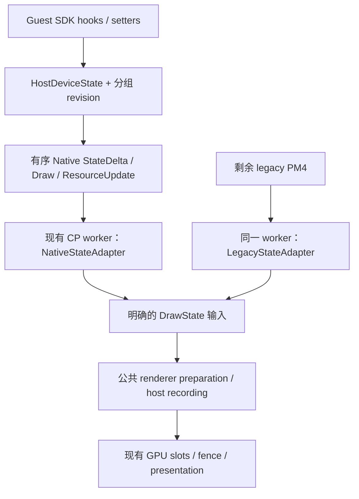

# Lost Odyssey 原生图形前端与 PM4 移除：开发交接

日期：2026-09-29

起点：`feature/native-pm4-bypass`，`e2a600b4958f38719dc62da34e666b9b9a58f881`

状态：方案与开发任务；当前局部 bypass 已实现，但真实游戏场景尚未测出性能收益。

## 1. 开发目标与第一步

**最终目标：让游戏受支持的图形路径通过原生接口提交状态、资源和绘制，消除 PM4 生产、解码及从寄存器重新构造绘制状态的中间工作。** 继续复用现有 Xenos shader 语义、纹理布局处理、renderer backend、同步及跨平台支持。

第一项可交付功能是：**在普通 mesh draw 的 SDK 状态 flush 之前接管调用，建立 host 状态及版本，交给现有渲染线程上的公共后端执行。** 这一阶段需要覆盖占主要负载的普通 indexed/non-indexed mesh，不能继续只扩大标题、四边形或 sparse-register record 的局部替换。

开发分阶段推进。混合 native/legacy 是过渡状态；最终还要处理 shader/state、UP、特殊 draw、clear/resolve/copy、同步、呈现和间接命令缓冲等剩余 PM4 依赖。每阶段分别记录实现、正确性验证、性能、用户验收和发布状态。

本文件交接的是开发工作，不代表代码已经完成、验收或发布。不要求每个阶段全通关，不设置凭空的“必须提升 20%”或“必须达到 120 FPS”门槛；需要实际覆盖证据，以及真实游戏场景中可重复、超出运行波动的 CPU 或吞吐改善。

## 2. 接手位置、已有改动和保护对象

当前工作树：

```text
C:/Users/freefrank/.codex/worktrees/native-pm4-bypass/LostOdysseyRecomp
```

下文相对路径均以此为根。`e2a600b4958f38719dc62da34e666b9b9a58f881` 是本轮的历史源码与测量基线；接手时应取得 `feature/native-pm4-bypass` 的最新交接提交，并核对实际 branch、HEAD、工作区 diff 和构建输入，保留无关改动。后续验收与交接提交包含以下工具和文档：

- `tools/perf/run_native_title.py`、`tools/perf/README.md`：真实 Uhra 场景、`--fps 120` 与对照方法。
- `docs/notes/native-command-bypass.md`、`docs/notes/native-command-uhra-results.json`：验收证据与边界。
- `CHANGELOG.md`、`docs/STATUS.md`、`docs/ROADMAP.md`、`docs/ROADMAP.zh-CN.md`：此前验收结论的同步。
- 本交接文档。

本机输入与历史构建：

| 对象 | 位置 / 身份 |
| --- | --- |
| 受保护的配置、存档和 shader 基线 | `C:/Users/freefrank/ownCloud/Git/LostOdysseyRecomp/out/issue70-runtime/baseline` |
| 游戏数据 | `D:/Mihoyo/LostOdysseyRecomp-windows-x64/game/disc1` |
| 历史测试 executable | `out/endian-constants/runtime/LostOdysseyRecomp.exe` |
| executable 大小 | 103842816 bytes |
| 历史 executable SHA-256 | `cc04ae26c1a610dd92c6038c02f73b64b268ef65508c250824a8d23b988d3b83` |
| link 输入记录 | `out/endian-constants/native-link.rsp` |
| 内嵌版本戳 | `0.7.11/45fbeb2-dirty`，旧戳 |

历史 executable 是开发 relink，使用本分支相关对象并复用未改动的旧对象，**不能称作 clean HEAD 构建**。同一组 A/B 使用的是同一个 executable。后续开发应建立明确的 source/object/executable 对应关系；不要仅凭窗口标题或内嵌旧戳判断版本。

游戏数据和原始 baseline 保持只读；运行时仅使用复制出的配置、profile、save、shader 与独立 cache。每次实验写新目录。保留现有比较证据，不清空 `out/`，不索引 `out/`。另一台机器需要提供等价的游戏 dump、同一存档/视角、依赖和 shader 包，不能仅复制本文路径。

## 3. 已确认的性能事实

### 3.1 真实 Uhra 场景，120 FPS target

普通运行对照使用 Uhra city plaza、D3D12、1280×720、SR/FG off、隐藏且静音、每次 20 秒，顺序为 `off → all → all → off`。CPU 是 OS user+kernel 时间除以日志完成帧数；完成帧回执约每秒一次，因此是窗口估计，不是逐帧延迟分布。FPS 为游戏完成帧率，不是物理屏幕扫描率。

| 模式均值 | FPS | CmdProc CPU ms/frame | 进程 CPU ms/frame | Guest Main CPU ms/frame |
| --- | ---: | ---: | ---: | ---: |
| off | 105.1506 | 7.786641 | 13.974594 | 2.226368 |
| all | 104.7048 | 7.801491 | 14.501339 | 2.576964 |
| all 相对 off | -0.4240% | +0.1907% | +3.7693% | +15.747% |

实际约 105 FPS，未触到 120 FPS target；这轮**没有测出 throughput 或 CmdProc 收益**。四次样本均正常退出、无强制终止、baseline 保留、无 error 级运行日志。截图为同一广场视角，NPC 动画阶段不同；未见明显新增缺陷，不代表同输入像素一致。

60 FPS 对照中 CmdProc 点估计下降约 5.216%，但受封顶及单次范围重叠影响，不能认定稳定收益。标题测试负载过轻，只保留为历史记录。两种模式都包含 `e2a600b` 的 index-cache 复用，不能从这个 A/B 单独估计该改动收益。

证据：[Uhra 结果 JSON](native-command-uhra-results.json)、[现有实现与完整验收说明](native-command-bypass.md)。原始普通 120 FPS 样本在 `out/native-pm4/uhra-120-{off-1,all-1,all-2,off-2}/`。

### 3.2 独立分段诊断

`out/native-pm4/uhra-120-stage-verified/` 的诊断采集启用了 `LO_RENDER_TIMING=1`，有效窗口为 3315–4289，共 975 帧。平均值：

| 观测项 | 结果 |
| --- | ---: |
| renderer Draw | 6.044 ms/frame |
| record / bind | 1.608 / 1.052 ms/frame |
| constants / vertex / index | 0.699 / 0.686 / 0.587 ms/frame |
| descriptor sets | 0.573 ms/frame |
| fence wait | 0.002 ms/frame |
| GPU renderer batches | 0.776 ms/frame，974 个有效帧 |
| Draw 调用量 | 约 1981/frame |
| 窗口内新建 shader / pipeline / texture | 均为 0 |
| native indexed quad / auto fan | 约 15/frame / 0 |
| native register blocks / values | 约 5924 / 16958 每帧 |
| native words / 等价 PM4 words | 约 40715 / 24531 每帧，增加约 66% |

分段是**会重叠的墙钟区间**，不可相加；GPU batches 不包含完整 present/compositor，不能称作全 GPU 帧时间。该诊断的 CmdProc 约 8.70 ms/frame，受计时开销影响，不能直接与普通 A/B 的 7.80 ms/frame 比较。`LO_GPU_STATS` 和 `LO_RENDER_TIMING` 都会打开 renderer 每 draw 计时。

这些结果支持“本机 RTX 5080、此 Uhra 场景主要受 CPU 侧渲染准备与提交限制”的判断。**纯 PM4 parser 耗时、生产端 wrapper 耗时及各项额外工作所占比例尚未独立测出。** 不得把 CmdProc 全部时间或进程增加的 3.77% 归给 PM4。

本地诊断：[stage-breakdown.json](../../out/native-pm4/uhra-120-stage-verified/stage-breakdown.json)、[runtime.log](../../out/native-pm4/uhra-120-stage-verified/runtime.log)。`uhra-120-stage-all` 和 `uhra-120-stage-all-final` 的驱动等待失败，不能当作成功采样；适配方法见第 9 节。

## 4. 当前方案为何没有完成目标

当前实现仍是：

```text
guest draw / dirty-state 处理 / 资源与 UP 准备
    → 少数位置将 PM4 改成 native record，仍写入原 ring/IB
    → CP worker 读 record，回填寄存器与 MMIO
    → ExecuteDraw → renderer::Draw → DrawImpl
    → 从 CP 寄存器重新取状态、准备常量/资源、记录 host draw
```

**hook 太晚，覆盖面太窄。** `NativeIndexedQuad` 位于 state/geometry allocation 之后；`NativeAutoFan` 也在已有状态 flush 之后。当前两种 native draw 在稳态仅约 15/frame，renderer Draw 约 1981/frame。数量级不足 1%，但计数层不同，不应把该比例当成精确功能覆盖率。`all` 只表示启用现有三个 hook，绝不表示整个 renderer 已 native。

**寄存器 record 增加了固定工作。** 每块约 2.86 values；原生固定 4 dword header，而旧 type-0 平均约 1.26 个连续 run header。生产端与消费端仍有多次 mask/run 遍历、栈数组、复制、MMIO 端序转换、worker stage 与统计更新。流量和重复工作有源码证据，但还没有逐项耗时归因。

**昂贵的后端准备基本保留。** 两个 native draw 最终仍执行同一 `DrawImpl`，包括寄存器派生状态、shader/pipeline 查找、常量快照、vertex/index 准备、绑定与 host command recording。常量每 draw 仍构造 VS/PS 各 4 KiB 快照；它不是无条件 8 KiB endian 转换，`ReadRegisters` 已可直接读取 native 值，零值仍有 MMIO fallback。

已有复用包括：2 GPU slots、fence 回收、descriptor reuse、`UploadUnchanged`、vertex cache 和转换后的 index cache。它们是本次架构应复用的基础。此前常量 snapshot 的 chunk-compare 实验在所有测试密度的 median 都更慢，已移除，详见 [renderer-endian-reuse.md](renderer-endian-reuse.md)。在没有可靠写入追踪前，不要重新引入同类“每 draw 再比较一次全部内容”的方案。

## 5. reblue 可以借鉴的边界

参考版本固定为官方仓库 [zolaware/reblue，ce0edadbb79007526842dadebf80941bf8ea46ca](https://github.com/zolaware/reblue/tree/ce0edadbb79007526842dadebf80941bf8ea46ca)。

| 机制 | 固定源码证据 | 对 LO 的启示 |
| --- | --- | --- |
| 在主要 draw SDK 入口接管 | [hooks/draw.cpp:83–159](https://github.com/zolaware/reblue/blob/ce0edadbb79007526842dadebf80941bf8ea46ca/src/gpu/hooks/draw.cpp#L83-L159)、[583–601](https://github.com/zolaware/reblue/blob/ce0edadbb79007526842dadebf80941bf8ea46ca/src/gpu/hooks/draw.cpp#L583-L601) | `DispatchDraw → FlushRenderStateLocked → host draw`；覆盖 DrawVertices/UP/Indexed/Begin/End 层级 |
| 取消原 ring 生产入口 | [hooks/device.cpp:219–227](https://github.com/zolaware/reblue/blob/ce0edadbb79007526842dadebf80941bf8ea46ca/src/gpu/hooks/device.cpp#L219-L227) | RingBufferAlloc/Flush/SubmitBatch/WaitForSpace 已 stub；LO 只有在相应生产者全部接管后才可这样做 |
| 保留 setter 语义并追踪 dirty | [hooks/state.cpp:249–292](https://github.com/zolaware/reblue/blob/ce0edadbb79007526842dadebf80941bf8ea46ca/src/gpu/hooks/state.cpp#L249-L292) | 常量 setter 执行原 setter 后标记 dirty；还需覆盖直接游戏写入 |
| 依 dirty 更新常量和绑定 | [constant_buffers.cpp:345–435](https://github.com/zolaware/reblue/blob/ce0edadbb79007526842dadebf80941bf8ea46ca/src/gpu/constant_buffers.cpp#L345-L435)、[draw_bindings.cpp:71–147](https://github.com/zolaware/reblue/blob/ce0edadbb79007526842dadebf80941bf8ea46ca/src/gpu/draw_bindings.cpp#L71-L147) | VS/PS 在 dirty 时复制/换序；SharedConstants 仍构造并比较，不能泛化为完全无检查 |
| 建立资源身份与寿命 | [native_texture_mirror.cpp:396–471](https://github.com/zolaware/reblue/blob/ce0edadbb79007526842dadebf80941bf8ea46ca/src/gpu/native_texture_mirror.cpp#L396-L471)、[bindless.cpp:81–115](https://github.com/zolaware/reblue/blob/ce0edadbb79007526842dadebf80941bf8ea46ca/src/gpu/bindless.cpp#L81-L115) | 创建/绑定/销毁统一，descriptor 依 fence 延迟回收 |
| 串行 command-list owner 与帧复用 | [device.h:260–279](https://github.com/zolaware/reblue/blob/ce0edadbb79007526842dadebf80941bf8ea46ca/src/gpu/device.h#L260-L279)、[frame_ring.cpp:222–252](https://github.com/zolaware/reblue/blob/ce0edadbb79007526842dadebf80941bf8ea46ca/src/gpu/frame_ring.cpp#L222-L252) | 不是靠多线程 command recording 获得此结构；LO 先保持现有 GPU owner |

reblue 仍处理 Xenos shader、texture fetch/tiling/endian、UP upload、quad expansion 与 resolve。目标是采用其高层接管、状态增量更新和资源镜像方式；不复制游戏地址，不先重写 shader 系统。其源码也不能证明 LO 会获得相同 FPS 增幅，或证明 reblue 全游戏 100% 动态路径均已验证。

## 6. 目标架构与必须明确的契约

下面是建议的数据边界，名称为设计示意，当前仓库尚未实现这些接口：



### 6.1 提前接管完整 draw 调用

阶段 0 只补最小未知项：主要普通 mesh 的实际入口、参数、flush 前后副作用、相关 setter/direct-write 来源和特殊命令缓冲寿命。当前已知 quad/auto-fan 地址不能当作普通 mesh 主入口。

对选中入口列出三类行为：必要 guest ABI/状态写回、资源及临时状态记账、纯 PM4 构造。native 成功路径跳过后者，保留前两者的语义。资格不符或预分配失败时，在提交任何可观察改变前执行原 producer。

不能简单跳过所有 dirty 清零/恢复指令。现有生成代码会读 dirty masks、调用 flush 后清 mask，UP 路径还会暂时修改 device 字段并在退出时恢复。需要明确 accepted/rejected 两条路径的返回值、cursor、dirty acknowledgement 和临时字段恢复点。

### 6.2 显式状态输入与版本

按 shader、VS/PS/constants、vertex/index binding、textures/samplers、pipeline、targets/viewport 等状态组维护 host 值和 revision。至少区分：

- producer 已发生的状态修改；
- consumer 当前应用的 revision；
- 当前 GPU slot 已上传/绑定的 revision 与资源 epoch。

slot 回收、arena/descriptor pool 重置后，producer 没变也可能需要重新上传/绑定。TAA jitter、MV 和 frame/draw 派生修改应用于工作副本或派生数据，不能污染可复用的基础常量。

Native draw 引用有寿命保障的状态或不可变 delta，避免每 draw 再复制所有寄存器或常量。只对真正覆盖的写入入口使用 revision 省略检查；未覆盖的直接内存/MMIO 写入继续保留现有正确性路径。guest 地址相同不表示资源 allocation 或内容相同。

已提交 draw 必须引用该执行位置对应的稳定状态版本；对象存活和 revision 编号本身不能保证旧内容仍在。可采用不可变状态版本，或按原执行顺序应用携带自有值的 delta；消费者不得延迟读取仍被 producer 修改的当前 HostDeviceState。发布命令前完成 payload 及引用初始化，消费完成前不得覆盖相关 CPU 数据；重复执行的命令仍遵守第 6.5 节寿命契约。

### 6.3 一个 GPU owner，共用后端

当前 renderer 初始化、执行、提交和 slot 回收均属于 CP worker。**guest hook 不得直接调用现有 renderer**；它只建立 host 状态及有序工作。

从 `renderer.cpp` 抽出接受明确 `DrawState` 的公共 preparation/recording 边界。legacy adapter 负责把当前寄存器、shader 与 resource 状态转换为输入；native adapter 提供已整理的输入，并以 revision 驱动增量准备。需要逐步消除公共 backend 对 `Reg()`、`g_commandProcessor` 和隐式完整快照的反向依赖。

不复制整个 `DrawImpl`。继续共用 shader/PSO/texture cache、EDRAM/resolve、AA/MV/FG、上传、descriptor 和 host command recording。消除 PM4 parser 不要求同时删除渲染消费线程；线程搬迁或多线程录制不属于首轮必要条件。

### 6.4 有序 transport 与 native/legacy 切换

过渡期以原 ring/间接命令缓冲的**执行位置**维持顺序；不得另建仅按 hook 调用时刻消费的 FIFO。记录时刻与执行时刻不同，嵌套命令缓冲也会改变实际执行次序。

可用有界 inline payload 或稳定 host payload 引用作为过渡承载，选择前先确定第 6.5 节的重放寿命。该承载应传递语义状态和 draw，不能继续每小块回填 register bank 再让 backend 全量解析。仍依赖 ring/PM4 调度的阶段必须标作混合状态。

native 消费更新公共有效状态；legacy register/shader writes 必须使对应 native state/cache 失效。native 跳过 SDK flush 后，下一次 legacy draw 不能读取陈旧 CP 状态：明确选择边界补齐兼容状态，或让 legacy adapter 读取一致的公共状态，并保留 guest 可见寄存器读回语义。

fallback 的决定放在 producer 资格检查/准备阶段。consumer 一旦产生 upload、draw、flush 等副作用，就不能再重放旧 draw；`DrawImpl` 前段已可能 flush。malformed payload 或执行失败应沿现有明确错误路径处理，不得通过“再画一次 legacy”掩盖。predication/bin mask 应在与原路径等价的位置判断。

### 6.5 间接命令缓冲重放与资源寿命

本文将 **indirect command buffer 称作“间接命令缓冲”**，将 index buffer 称作“索引缓冲”；两者不能混用。

现有 native record 只携带值，可随间接命令缓冲重复执行。如果改为 host payload handle，需要绑定命令块 allocation/generation，允许重复消费，并在该命令块真正失效后释放。不能首次消费即删除，也不能仅凭 read pointer 前进或某次 GPU fence 完成就认为命令块永不重放。首阶段可让未解的 recorded/nested 路径保留 legacy，计入未覆盖范围。

分别定义记录时快照、继承调用者状态、执行时读取资源三种语义；不能一概冻结所有资源。UP 输入应在原调用允许调用者改写之前取得所需拥有权或副本。

资源身份需区分 allocation generation 与 content revision；覆盖写、释放重建、GPU resolve 写入都要正确失效。索引缓冲保留 format/base/offset/count/endian/topology 等原语义。CPU 命令 payload 寿命和 GPU 引用资源寿命分别管理；后者复用已有 slot fence 回收，不能提前释放 descriptor、upload 或 texture。

### 6.6 写入覆盖与完成统计

开发诊断至少能回答：普通 mesh 命中多少、真正跳过 SDK flush 多少、native/legacy draw 各多少、还有哪些 PM4 producer/opcode、fallback 原因是什么。按实际执行计数，避免把可重放命令的“创建次数”当成“执行覆盖率”。

新增细粒度计时与逐 draw 日志保持按需启用。普通性能对照只保留必要的低成本回执，不能每块反复扫描仅为了统计。一个场景里 PM4 计数为零，只证明该场景窗口；声明整体实现覆盖还需路径盘点和剩余清单。

## 7. 分阶段开发与退出条件

| 阶段 | 具体工作 | 足够的交付与验证 |
| --- | --- | --- |
| P0：补齐入口契约 | 确认主要普通 mesh 入口、flush 前接管点、参数/返回/dirty/临时字段，相关 direct writes、资源 update/destroy 和特殊命令缓冲语义 | 地址/参数/副作用表，源码位置与最小未知清单；仅在调用频率无法静态判断时做有限诊断 |
| P1：抽公共后端输入 | 建立明确 DrawState 与 legacy adapter，保持当前线程 owner 和渲染语义 | 受影响代码编译；复用既有 fixture，只补真实状态转换风险；必要时做一次受影响场景功能检查 |
| P2：普通 mesh native 路径 | flush 前 hook、typed state/revisions、有序消费、mixed 同步与无副作用 fallback | 普通 mesh 覆盖、跳过 flush 证据；native↔legacy 切换、状态改变、资源更新和退出的有限功能验证；随后做普通 Uhra 120 FPS 对照 |
| P3：移除剩余 PM4 依赖 | UP/特殊 draw、recorded/nested 命令、shader/state、clear/resolve/copy、等待/事件/呈现；按剩余清单推进 | 每项语义、剩余 producer/opcode 及原因；针对重放、地址复用、同步的必要 fixture/场景证据 |
| P4：完成及启用决策 | 支持范围内默认图形路径不再依赖 PM4 生产/消费；关闭 legacy 调度仍可运行相应路径 | 实现覆盖表、真实用户路径与平台验证矩阵、同条件性能结果、回滚方法；未验证范围明确保留 |

P0 与 P1 的独立部分可以并行；接口确定前不进行耦合改动。P2 即进行性能检查，避免等完成全部迁移才发现新 state/transport 仍制造大量固定开销。

性能验收同时看 throughput、CmdProc、Guest Main/其他生产线程和整个进程 CPU，避免把工作移到别的线程后宣称收益。若结果仍在波动内，记为“未验收收益”；针对最大的已观测热点继续定位。不要以加速器包大小、draw 数、成功启动或 exit 0 替代性能结论。

Windows D3D12、Windows Vulkan、Linux Vulkan 等按项目支持范围分别记录“编译 / 功能运行 / 性能 / 未验证”。共享层改动按实际影响补验证；缺少某平台机器时说明限制，不伪称已通过。全通关不是每阶段前置门槛。

历史文档的 default-off 和未验收结论保留作证据，不构成禁止本方案继续开发的永久门槛。新路径默认启用应依据新路径自己的正确性与收益证据。

## 8. 源码定位与分工

以下行号对应起点快照，后续移动后以 symbol 为准。当前工作树无 `.codegraph/`；有索引的 checkout 先使用 CodeGraph，否则用 `rg`，无需为此索引整个仓库。

| 文件 / 起点 | 已知内容或改造责任 |
| --- | --- |
| [native_command_hooks.cpp](../../LostOdysseyRecomp/gpu/native_command_hooks.cpp)，58–139 | `sub_823C1BD8` sparse writer；`NativeIndexedQuad` 和 `NativeAutoFan` 的范围/容量检查与晚期 hook |
| [native_command_stream.h](../../LostOdysseyRecomp/gpu/native_command_stream.h)，11–135 | 当前 inline 值、4-word header、mask/run 编解码与狭窄 draw selector |
| [command_processor.cpp](../../LostOdysseyRecomp/gpu/command_processor.cpp)，258–264、486–549 | GPU 初始化与 worker 所有权 |
| 同上，439–465、653–707、735–867 | native/MMIO 读值、ring/间接命令执行、native 消费与 ExecuteDraw；transport/legacy 桥接的共享修改点 |
| [renderer.h](../../LostOdysseyRecomp/gpu/renderer.h)，14–29 | 当前接口只接收拓扑/索引参数，隐式依赖 CP 状态 |
| [renderer.cpp](../../LostOdysseyRecomp/gpu/renderer.cpp)，227、5606–5900 | Reg、Draw/DrawImpl、shader/pipeline 派生、常量快照；公共输入边界的主要改造点 |
| 同上，396、1627–1654、3387–3438、3820–3840 | 已有 2 slots、UploadUnchanged、fence 回收与 descriptor reuse |
| 同上，5534–5558、7081–7198 | vertex 内容命中检查、常量上传与 index 缓存；不能无写入契约删除检查 |
| [LostOdysseyRecomp.toml](../../LostOdysseyRecompLib/config/LostOdysseyRecomp.toml)，约 206、214 | 持久 hook 配置；`0x823CD44C → 0x823CD52C`、`0x827B5984 → 0x827B5A68` |
| `LostOdysseyRecompLib/ppc/ppc_recomp.12.cpp`，31990–32078、43562–43662 | 原 sparse writer 与相关状态准备 |
| `ppc_recomp.12.cpp`，59071–59086、59388–59396；`ppc_recomp.74.cpp`，5897–5937、6127–6194 | dirty flush/ack 及临时状态保存恢复的实例；用于契约调查，不代表普通 mesh 主入口已确定 |
| [ppc_codegen.py](../../tools/ppc_codegen.py) | 官方生成入口；持久改动放 hook 配置/源码，按需重生成，不能只手改生成 cpp |
| [native_command_stream_test.cpp](../../tools/tests/native_command_stream_test.cpp) | `LoNativeCommandStreamTest`：已有寄存器/镜像、快照重放、容量、rollover、索引语义 fixture |
| [tools/README.md](../../tools/README.md)、[tools/perf/README.md](../../tools/perf/README.md)、[BUILDING.md](../BUILDING.md) | 既有工具和构建入口；优先复用，新增可复用工具放 tools/ |

普通 mesh 高频主入口的精确地址和签名仍待 P0 确认；不要编造，也不要把 `sub_823CD050` / `sub_827B56B0` 的局部 hook 命中当成覆盖证明。

建议 ownership：

| 工作 | 文件边界 / 协作方式 |
| --- | --- |
| A：SDK producer/state/resource | hooks、新增 host state/resource 模块、hook TOML 与生成配置；提交完整 guest 调用契约 |
| B：公共 renderer backend | renderer.h/cpp 及新增 draw-state 模块；由一名 owner 整合巨大 renderer.cpp，避免多个 agent 同改 |
| C：transport/legacy bridge | command_processor.h/cpp、native stream/replay 模块；该共享文件由同一 owner 整合 |
| D：验证/驱动 | tools/perf、相关 tools/tests 与忽略的实验输出；独立于运行时代码 |
| 主代理 / docs_sync | 协调接口，审阅 diff，记录验证、覆盖、验收与发布状态 |

先约定 DrawState、revision、payload 寿命、mixed 边界，再并行实现。各 agent 共享进展且保留其他人的改动。已有 passing 检查按覆盖范围复用，不因提交、换 worktree 或文档同步重复测试。

## 9. 可复现的普通运行与诊断限制

### 9.1 现有 120 FPS ABBA

需要 Windows、Python 3.11+ 和已安装的 `psutil`。在上述工作树执行，`--build` 指向含候选 EXE/DLL 的目录。以下参数已对照当前脚本；输出目录每轮新建：

```powershell
$pm4Build = 'out/endian-constants/runtime'
$pm4Baseline = 'C:/Users/freefrank/ownCloud/Git/LostOdysseyRecomp/out/issue70-runtime/baseline'
$pm4Game = 'D:/Mihoyo/LostOdysseyRecomp-windows-x64/game/disc1'
$pm4RunId = Get-Date -Format 'yyyyMMdd-HHmmss'
$pm4Cases = @(
    @{ Name = 'off-1'; Mode = 'off' },
    @{ Name = 'all-1'; Mode = 'all' },
    @{ Name = 'all-2'; Mode = 'all' },
    @{ Name = 'off-2'; Mode = 'off' }
)
foreach ($pm4Case in $pm4Cases) {
    $pm4Output = "out/native-pm4/next-$pm4RunId-$($pm4Case.Name)"
    python tools/perf/run_native_title.py --build $pm4Build --baseline $pm4Baseline --game $pm4Game --output $pm4Output --mode $pm4Case.Mode --scene uhra --fps 120 --backend d3d12 --warmup-frame 3300 --sample-seconds 20 --startup-timeout 180
    if ($LASTEXITCODE -ne 0) { throw "Probe failed: $pm4Output" }
}
```

这是现有三 hook 方案的复现命令。新架构需要为驱动明确接入新的 native/legacy 开关并记录模式，不能把现有 `--mode all` 当作自动启用未来实现。保持同一候选 executable 内的开关对照；如必须用两个构建，记录除目标改动之外的差异。

驱动复制 baseline，设置固定 720p、120 FPS target、SR/FG off、静音/隐藏，隔离 shader cache，清除继承的 `LO_*` 变量。Uhra 自动输入为：

```text
LO_AUTO_BUTTONS=s@120,a@240,a@360,a@480,a@700,a@900
LO_AUTO_PULSE=6
LO_AUTO_STICK=0,18000,1600,1900
```

以场景载入标记和至少 3300 完成帧作为进入条件；截图在计时之后，正常关闭仅作用于驱动拥有的进程。60/120 FPS 的移动时间按 swap 计数，镜头可能不同，因此只在同一目标帧率的模式间比较。先确认真实游戏画面及 draw 负载，再解释数值。

普通 A/B 不使用 `--scene-stats` 或 `LO_RENDER_TIMING`。若达到 120 FPS 封顶，优先比较受控 CPU 成本；需要更高上限时使用项目已有且已验证的设置，记录新条件，不臆造不支持的参数。

### 9.2 重用分段诊断前必须修复的驱动问题

当前 `latest_frame()` 只匹配 `frame timing completed=`；启用 `LO_RENDER_TIMING=1` 后日志变为 `present timing completed=`，会导致等待永远读到 0。高密度日志还会让初始 `xenon_scr.fpd` load marker 离开末尾 1 MiB。

成功的 `stage-verified` 运行用了临时 wrapper：在子进程 env 注入 timing、兼容两种 completed 回执，并在观察到 scene marker 后锁存。**这些修正尚未保存进仓库驱动。** 后续确需分段分析时，将这三个行为作为显式诊断选项适配现有脚本，并测试日志解析/进入条件；不要重跑那两次失败尝试，也不能仅在父 shell 设置 timing，因为脚本会清除继承变量。

分段诊断用于找成本，普通运行用于验收收益。保留准确执行窗口、原始日志、executable 身份、配置、normal exit 和 baseline 检查结果。

## 10. 最终交付与可复制的开发提示

开发交付至少包括：源码 diff；真实入口及覆盖/未覆盖清单；线程、mixed state、间接命令重放、dirty 与资源寿命契约；受影响的编译/功能验证；真实游戏 120 FPS 普通对照及原始证据；平台边界、剩余热点与回滚方式。

更新实际受影响的说明、STATUS/roadmap 和 CHANGELOG；计划不能写成已完成特性。若改 README，保持英文/中文同步。只为新行为、失败或尚未解决的具体风险扩展验证。

可以把下面这段连同本文交给开发 agent：

```text
请按《native-renderer-pm4-removal-handoff.zh-CN.md》实施 LostOdysseyRecomp 原生图形前端。
最终目标是移除受支持图形路径的 PM4 生产/消费；第一项可交付功能是在普通 mesh SDK flush 前接管 draw，建立 host state/revisions，经现有 CP worker 的公共 renderer backend 执行。

从 feature/native-pm4-bypass 的最新交接提交接手；`e2a600b` 仅作为历史源码与测量基线。先核对实际 diff、构建来源和基线，保留无关工作。P0 只补普通 mesh 主入口、guest 状态写回/direct writes、资源与特殊命令缓冲的关键未知；然后实施公共 backend 输入和普通 mesh 路径，不停在方案或 packet 格式优化。

保留当前 GPU owner。mixed 阶段维持原执行顺序，处理 native↔legacy 状态同步；fallback 在副作用提交前决定。间接命令缓冲可重放，payload 和 GPU 资源分别管理寿命。只对有完整写入覆盖的状态使用 dirty/revision 省略检查，复用现有 slots/fences、descriptor、UploadUnchanged 与缓存。

独立任务按文件 ownership 并行，公共接口和共享文件由单一 owner 整合。保护原始 game/save/config/baseline，每次实验用新的隔离输出。复用已有验证；按新行为做必要检查，以 Uhra 120 FPS 普通运行验证 CPU/throughput 和覆盖，诊断计时单独采集。持续列出剩余 PM4 依赖，区分局部迁移和最终完成，说明未验证的平台和场景。

交付可审阅代码、证据、未覆盖项和回滚开关。遵循接手会话的授权；本文本身不授权 commit/push/tag/release。
```
