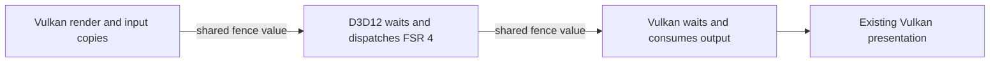

# Vulkan frame generation, FSR 4 and MetalFX

Source review: 2026-10-01. Branch: `feat/vulkan-frame-generation`, rebased onto
`3e0b549` (v0.7.25 main, including the macOS integration from PR #113).
The earlier version of this note incorrectly assessed macOS from a stale checkout;
the application already has native Metal, MetalFX spatial/temporal SR and macOS
platform support. This implementation builds on that port.

## Result

| Feature / platform | Implementation and limits |
|---|---|
| DLSS FG, Windows Vulkan | Implemented persisted settings and fixed 2×–6× requests, limited by the actual Streamline capability. Existing proxy retained for live Off/On and multiplier changes. On an RTX 5080, 2×, 4× and 6× generate frames, including scaled 1080p input and after window resize/minimize/restore. |
| FSR 3.1.4 FG, Windows Vulkan | Implemented the FidelityFX 1.1.4 adapter, exclusive queue reservations, opt-in logical-device extensions/features, replacement WSI, depth conversion, Prepare/Generate, host-fence input retirement, resize and settings. Fixed 2×, immediate presentation. On an RTX 5080 it generates every prepared frame, including scaled input and after window lifecycle changes. Source builds only. |
| MetalFX FG, macOS Metal | Implemented `MTLFXFrameInterpolator` and generated-then-real presentation on the existing Metal backend. Requires macOS 26 and `supportsDevice:`. Fixed 2×, live Off/On. Experimental; not run on Mac hardware. |
| DLSS dynamic MFG, Vulkan | Explicitly rejected: Streamline 2.14.1 documents dynamic MFG as D3D12-only. |
| DLSS FG, native Linux Vulkan | The pinned Streamline release has no native Linux FG runtime. No Linux provider advertised. |
| FSR FG, native Linux Vulkan | Algorithm sources exist, but the pinned SDK presenter depends on Win32 threads/events/timing. A native presenter port is still required; existing Linux FSR SR is unaffected. |
| MAKO / LSFG, native Linux Vulkan | Separate external-layer option, reviewed at `06ecf6e`. Uses the user's Lossless Scaling installation. Native/AppImage launch procedure below; no game/GPU acceptance claimed. The reviewed Flatpak extensions do not include this game's 26.08 runtime. |
| OptiScaler, Windows | Implemented optional early DLL loading using the existing NGX input adapter. Upstream supports D3D12/Vulkan SR, including FSR 4 on supported hardware; OptiFG remains D3D12-only. Loader tests pass; actual OptiScaler rendering is unverified. |
| FSR 4 SR / FG | Feasibility research below. SDK 2.3 has no official Vulkan backend; OptiScaler's Vulkan SR uses Windows DX12 interop. No FSR 4 adapter claimed. |

These are experimental integrations. The branch was written without a physical
GPU; the review on 2026-10-01 then ran the Windows Vulkan paths on an RTX 5080
(see Validation) and fixed what it found. Compilation, CPU tests and SDK
counters do not establish generated-image quality, GPU validation cleanliness or
display delivery.

## Windows Vulkan integration

The settings and environment parser expose exactly the compiled providers.
`LO_FG_PROVIDER=off` overrides saved settings and the legacy `LO_DLSS_FG=1`.
Explicit provider selection retains whole-request defaults; individual overrides
otherwise replace the corresponding saved fields. Invalid requests preserve
ordinary rendering, without silently selecting another SDK or multiplier.

Starting with FG Off, or changing between DLSS and FSR, requires a restart: each
SDK owns the Vulkan device/WSI setup. Changing providers disables the existing
feature immediately. An installed provider can turn Off/On without rebuilding
the device. A failed startup is reported unavailable, not an endless restart
request. The SDK proxy, and the immediate presentation both Vulkan SDKs need,
remain while Off; restart with FG Off to remove them.

The renderer now captures native-resolution FG inputs on Vulkan as well as
D3D12/Metal, independently of SR. Same-frame producer/resolve identity remains
mandatory. Color may be uniformly scaled to the output while depth and motion
retain their input dimensions. Letterboxing/pillarboxing is rejected because
this path has no subregion tags. The fully composited color includes game UI;
no separated HUD or dynamic-object motion coverage is promised.

Update, 2026-10-02: the bars limit above describes the 2026-10-01 state. Since
PR #146 (shipped in v0.7.35) an output taller than 16:9 renders the 3D scene
across the whole drawable, so the bars that kept frame generation off on those
outputs are gone and it now runs on them. That has not been tested; see the
[tall layout note](tall-aspect-layout.md#review-changes--2026-10-02).

### FSR queue and resource ownership

`fsr_frame_generation_vulkan.cpp` loads the local Vulkan FFX API DLL and queries
both interpolation and swapchain providers. It does not require Streamline or
an FSR SR build.

- When starting FSR, Plume enables the supported timeline semaphore, float16,
  16-bit storage and subgroup-size-control extensions and features on the
  logical device. This matches the physical capabilities FidelityFX uses to
  select shader permutations. Both the extensions and the feature structs are
  opt-in (`enableFrameInterpolationFeatures`), so ordinary devices are unchanged
  and nothing conflicts with Streamline's aggregate Vulkan 1.3 feature struct.
- FidelityFX 1.1.4 looks up `vkGetBufferMemoryRequirements2KHR` through the
  `vkGetDeviceProcAddr` it is given. That KHR name is an alias of a Vulkan 1.1
  core command whose extension Plume does not enable, and NVIDIA drivers return
  NULL for it; the SDK then called a null pointer on its first resource
  allocation. The adapter's proc resolver falls back from a promoted `…KHR`
  name to the core name. This keeps device creation unchanged for every
  platform and covers future promoted lookups without new extensions.
- The SDK requires four distinct native queues even with async interpolation
  disabled. The host keeps its graphics queue; the adapter reserves compute,
  present and acquire queues from the queues actually created by Plume, checks
  surface presentation support, and leaves host allocation capacity in every
  used family. Later virtual queues cannot borrow reserved SDK queues.
- SDK submissions to the shared game queue take its existing mutex. Plume
  delegates proxy-present synchronization to the hook so it does not hold that
  mutex while FFX invokes the submission callback. Ordinary WSI fallback keeps
  the original locking behavior.
- The FFX swapchain must be destroyed before its replacement is created. The
  opt-in Plume resize path drains SDK work, destroys old views/context, then
  creates the replacement. The hooks and queue reservations remain alive until
  after the last SDK swapchain has been destroyed.
- FFX 1.1.4 expects its replacement images in **SHADER_READ_ONLY_OPTIMAL** at
  present, including FG-Off passthrough (`ReplacementBufferTransferState`).
  Streamline's existing proxy uses a different layout. Ordinary native WSI uses
  PRESENT_SRC_KHR. These paths are handled separately.
- Prepare receives a finite reversed-depth remap, same-frame motion, camera
  basis, jitter, milliseconds and a monotonic SDK frame ID. Configure precedes
  Prepare; the SDK invokes Generate. Cancellation first discards unsubmitted
  commands; an attempted submission is never treated as cancelable.

Only Prepare reads the game's depth and motion images. It is recorded into the
host presentation batch, and interpolation itself uses the SDK's dilated
copies and its own replacement images (`FfxFrameInterpolationDispatchDescription`
has no depth or motion input). The host already waits for its previous
presentation fence before recording the next frame, so `AfterHostDrain()`
retires the input lease, the producer snapshot and the depth conversion there.
No steady-state frame waits for SDK presentation or idles the device. The SDK's
`waitForPresents` plus a native device idle run only at configuration, resize,
cancellation and shutdown boundaries. Only the WSI entry points are hooked;
`vkDeviceWaitIdle` keeps its native behavior for every other caller.

An earlier revision drained SDK presentation and idled the device twice per
frame, also while FG was Off with the proxy installed; input lifetime never
needed those waits. Recoverable failures now disable FG instead of ending the
process: a rejected present (its batch still retires through the host fence), a
failed `configure(false)`, and a failed host submission (which per the Vulkan
specification leaves recorded resources unused). Termination remains only where
GPU completion cannot be established. FidelityFX's own `waitForPresents` can
still race its presenter thread at those boundaries; the SDK has the same
exposure on resize and destruction.

The FidelityFX Vulkan presenter paces real and generated frames itself: it
acquires and presents twice per real frame and waits half the measured frame
time between them. Under FIFO those acquire and present waits stack on its
pacing. On an RTX 5080 with a 144 Hz display the game then ran at exactly
36 FPS, a quarter of the refresh rate, with or without the per-frame waits
above, while D3D12 FSR FG kept 60 FPS with vsync. With immediate presentation
the Vulkan path generates on every prepared frame and stays near the 60 FPS
target (see Validation). The game therefore requests immediate
presentation while the FidelityFX proxy owns the swapchain, as it already does
for Vulkan DLSS FG; a driver without immediate mode keeps FIFO and logs the
lower real rate.

### Build and select

Apply the tracked Plume patches through the normal repository setup. Configure
a Windows x64 GPU build with the official SDK **1.1.4** sources/API headers and
its Vulkan FFX API runtime (the SDK can build it with `FFX_API_BACKEND=VK_X64`):

```text
-DLO_ENABLE_VULKAN_FSR_FG=ON
-DLO_FSR_SDK_ROOT=/path/to/FidelityFX-SDK-1.1.4
-DLO_FSR_VULKAN_FG_RUNTIME=/path/to/amd_fidelityfx_vk.dll
```

The DLL is copied beside the game. No SDK binaries are committed. The game looks
for the DLSS, Streamline and FidelityFX runtimes in the executable's `ngx/`
folder (Linux packages), then beside the executable, and only then in the working
directory (`os/runtime_libraries.h`). An explicit `--game` launch from another
working directory therefore still finds them, and staged test directories that
hold their own copies keep working. Select
Vulkan and FSR in Graphics, save, and restart when prompted, or use:

```powershell
$env:LO_GRAPHICS_API = 'vulkan'
$env:LO_FG_PROVIDER = 'fsr'
$env:LO_FG_MODE = 'fixed'
$env:LO_FG_MULTIPLIER = '2'
# Optional runtime override:
$env:LO_FSR_VULKAN_FG_RUNTIME = 'C:\SDK\amd_fidelityfx_vk.dll'
```

DLSS uses the existing `LO_ENABLE_STREAMLINE_FG=ON`, official
`LO_STREAMLINE_SDK_ROOT` and NGX requirements in
[`LoStreamline.cmake`](../../cmake/LoStreamline.cmake). Select `dlss` and request
2–6; `slDLSSGGetState().numFramesToGenerateMax` remains authoritative. DLSS keeps
its immediate-presentation requirement and the historical SDK validation caveat
in [the earlier acceptance record](gate1-host-repair-20260927.md).

For Linux, the missing work is a native version of the FFX swapchain/pacer's
threads, events, critical sections, QPC timing and waiting, or an independently
validated native presenter. Merely enabling the current SR library cannot do
this: `LoFsr.cmake` intentionally excludes interpolation/optical-flow shaders
and its SR-only patch removes the FG swapchain callback. Wine/Proton running a
Windows executable is a separate deployment model from a native Linux build.

## MAKO: an external Linux option and a presenter reference

Reviewed [MAKO](https://github.com/eugeniosegala/MAKO/tree/06ecf6ee87e601f9f2a6990ae7c50a5da6137992)
at `06ecf6ee87e601f9f2a6990ae7c50a5da6137992` (Renderer 4.0.0).
It runs LSFG through a native Linux Vulkan layer. It supplies neither a
FidelityFX adapter nor MetalFX integration. Frame generation and LS1 scaling
require a user-installed `Lossless.dll`; its open spatial scaler alone does
not provide frame generation. The DLL supplies model/shader resources; the
Linux path does not execute the Windows DLL through Wine.

The relevant source boundaries are:

| Source | What it establishes |
|---|---|
| `engine/mako-backend/include/mako-backend/mako.hpp` | The backend accepts two alternating color-image FDs, output-image FDs and a shared timeline semaphore. It has no game depth, motion-vector or camera input. |
| `engine/mako-render/src/instance.cpp` | The layer enables external-memory/semaphore FD extensions and the timeline feature before application-device creation. |
| `engine/mako-render/src/swapchain/resources.cpp` | Renderer-owned images and a semaphore are exported to the separate Vulkan backend; FD ownership transfers into `openContext`. |
| `engine/mako-render/src/swapchain/present/generated_frames.cpp` | Each generated image gets its own acquired WSI image, copy submission, semaphore wait and present. Generated frames precede the current real frame. |
| `engine/mako-render/src/swapchain/present/retirement.cpp` | Presentation retirement preserves upstream present fences and tracks the layer's own work separately. |

This demonstrates a practical native Linux presentation architecture. The
four-queue requirement in our Windows FSR adapter belongs to the pinned AMD
swapchain implementation, not Vulkan frame generation in general. A native
FSR presenter can be designed around the queues available on the actual GPU.

### Trying the existing external layer

Install MAKO Renderer and Lossless Scaling separately. In `mako-ui`, create a
profile named `LostOdysseyRecomp`, match the rendering executable
`LostOdysseyRecomp`, select the installed DLL, and start with fixed 2× and MAKO
scaling/shaders disabled. This isolates frame-generation behavior while the
game retains its own rendering and upscaling settings.

For a native Linux build, launch with:

```sh
env LO_GRAPHICS_API=vulkan LO_FG_PROVIDER=off \
    MAKO_PROFILE=LostOdysseyRecomp \
    "$HOME/.local/bin/mako-launch" "/absolute/path/to/LostOdysseyRecomp"
```

For AppImage, substitute the executable AppImage path. In a native Steam launch
option, substitute `%command%` for the executable. Use the full wrapper command
generated by MAKO Decky if launching through Decky. The explicit
`LO_FG_PROVIDER=off` overrides saved internal FG settings and `LO_DLSS_FG` for
this launch without editing `settings.ini`; SR remains independent. A missing
profile or missing layer activation can leave generation inactive even when
the game runs normally.

The game's FG status and frame counter describe its own provider/rendered
frames. MAKO's output must be checked with its diagnostics and presentation
measurements. This launch procedure is source-checked, not a completed GPU
test of Lost Odyssey. Neither Lossless Scaling nor game assets are available
in this executor.

**Flatpak has an additional packaging gap:** this project's manifest requires
Freedesktop **26.08**, while the reviewed MAKO runtime list contains only
**23.08, 24.08 and 25.08**. The published extensions therefore do not establish
support for this game's Flatpak. That requires a matching extension build and
sandbox access to its configuration and DLL. A host `mako-launch flatpak run`
prefix cannot supply those dependencies; use native/AppImage for initial
validation rather than changing the game's runtime to an older branch.

### Applying the design to native FSR

An in-engine FSR path can stay on Plume's Vulkan device and use the existing
same-frame color/depth/motion snapshots, avoiding MAKO's separate-device FD
bridge. The remaining implementation consists of two independent parts:

1. Build FidelityFX optical-flow and frame-interpolation components and their
   shader permutations on Linux. The current SR-only library omits both.
   Supply the FSR Prepare/Generate inputs and retain their exact producer
   resources through completion; replacing LSFG's color-only backend requires
   this additional contract.
2. Provide a native presenter with generated/real output ordering, per-image
   acquire/present semaphores, bounded recovery and resize/teardown retirement.
   Follow MAKO's distinction between generated work, accepted presents and
   actual display delivery. Gamescope must observe and pace each output;
   successful generation followed by unpaced MAILBOX presents can drop the
   interpolated image.

MAKO's GPL-3.0-or-later source is a useful implementation reference alongside
this project's GPLv3 code; incorporation would retain its upstream notices.
No MAKO source, model payload or binary is copied by this investigation. The
external LSFG route does not change the native FSR/FSR 4 support claims above.

## MetalFX FG on the existing macOS port

`LO_ENABLE_METALFX_FG` defaults On for macOS builds. The provider appears in the
graphics menu, whose help marks it experimental; `LO_FG_PROVIDER=metalfx` also
selects it. It supports fixed 2×. It has not been run on Mac hardware.
Older SDKs compile an unavailable path; macOS 26 availability and the actual
Metal device's `supportsDevice:` are both checked before input capture begins.
The integration uses regular `MTLCommandBuffer`, not Metal 4 command buffers.

`metalfx_frame_generation.mm` provides actual native color, previous-color,
remapped depth, motion and private output textures. Descriptor dimensions track
input depth/motion and output color separately. SDK texture usage requirements
are checked before encoding. The API takes **seconds and degrees**, converted
from the renderer's milliseconds and radians; motion vectors are scaled from
input pixels into previous-color/output pixels. No macOS 27-only content-offset,
projection-matrix or `requiresPrevColorTexture` properties are referenced. The
descriptor fixes an RG16Float motion texture at the input extent, as the D3D12
adapters require; a frame whose motion image has another format, an offset or a
larger allocation uses normal presentation and logs the mismatch once.

A reset frame primes SDK history and presents only the rendered image. A
continuous pair encodes interpolation, presents the generated image, drains that
submission, then presents the retained real image. Guest simulation, camera
history and renderer frame IDs advance only once. CAMetalLayer's minimum present
duration accounts for the two presentations. Host overlays, missing input,
configuration changes, resize and frame gaps reset interpolation history.

The initial path drains renderer inputs before reading their untracked Metal
textures. Explicit fences bridge Plume encoders into MetalFX and back. Input
leases retire after the host fence, including the second real-frame copy. A
command buffer that completed with an error no longer runs, so its lease is
released and FG becomes unavailable instead of ending the process; a failed
host submission does the same. Teardown waits for the session's own command
buffer, so it does not depend on the host wait succeeding after a GPU error.
SDK resource references are then cleared. Captures retain the original rendered
pixels, rather than labeling a generated image as the current renderer frame.
Host-only frames wait for the GPU only while MetalFX FG is requested.

The Plume macOS patch also fixes drawable-slot advancement to run solely on the
presentation thread, and drains the separate present command buffers before
swapchain resize/destruction. Their completion state is shared with the
handlers, so a handler that runs late never touches a destroyed swap chain. A
present that completes with an error is logged; it does not fail later resizes
or abort teardown.

Pacing follows the shared FG policy: the frame cap is divided by the multiplier
only when variable refresh is requested. On a fixed-refresh display a native
target at the refresh rate leaves no room for the generated present, so the
display halves the real rate; the default 30 FPS target fits 2× on 60 Hz.

Every interpolated frame still drains the renderer before reading its
untracked textures, and drains the generated present before the real one. That
conservative synchronization keeps CPU and GPU from overlapping; replacing it
with event-based cross-command-buffer ordering needs Mac hardware to validate
and is left for that work. A composited HUD can also interpolate poorly. No
quality or speed claim is made.

## FSR 4 and what OptiScaler demonstrates

Reviewed OptiScaler commit `435609d4080373a008cc0312fb65641d35feae9c`.
Its README lists Vulkan FSR 4 through **DX12 interop**. `FFXFeatureVkOn12`
constructs a `FFXFeatureDx12`; `IFeature_VkwDx12` implements shared images,
Windows handles, shared fences/semaphores and submission splitting. Its OptiFG
section explicitly says **DX12 only**. Vulkan SR support therefore cannot be
used as evidence that OptiScaler supplies a ready Vulkan FG presenter.

The game currently calls the statically compiled
`ffxFsr3UpscalerContextCreate/Dispatch` functions. It does not use the modern
FFX API upscaler DLL, so a driver-level FSR upgrade or replacing a DLL beside the
game cannot be assumed to upgrade this path.

For a native Windows implementation independent of OptiScaler, first add a D3D12 adapter using the
signed `amd_fidelityfx_upscaler_dx12.dll`, query provider versions for the actual
device and verify the selected provider after context creation. SDK 2.3's
Upscaling 4.1.1 documentation lists Radeon 7000-series **discrete** GPUs and
9000-series or later. Do not apply that SR hardware statement to FG 4: the FG
4.0.1 documentation has the narrower requirement shown above.

The current depth, motion, jitter, camera and color inputs are useful here.
Query resource requirements rather than unconditionally disabling reactive and
transparency masks: FSR 4 makes them optional, while a selected FSR 3 fallback
can still need them. Expose the actual selected version, and preserve SR/FG as
independent choices. FG 4 also requires the documented
Configure → Prepare → Generate call order and accurate camera basis data.

After native D3D12 validation, the Vulkan SR bridge can follow this sequence:



The bridge must match the DXGI adapter to the Vulkan physical device's LUID,
query each format/usage's external-memory compatibility, import/export shared
resources, and implement external queue-family ownership transfers. Input copy,
upscale and output reuse must all participate in the submission/lifetime model.
OptiScaler's Windows APIs (`CreateSharedHandle`, `vkGetMemoryWin32HandlePropertiesKHR`,
`vkImportSemaphoreWin32HandleKHR`, `D3D12_FENCE` handles) explain both its
feasibility and why it is not a native Linux implementation. Its performance
cost is workload-dependent; no OptiScaler benchmark is presented as a game
measurement here. No OptiScaler source was copied into the runtime.

## Optional OptiScaler loading on Windows

`LO_OPTISCALER_PATH` enables the new experimental loader before SDL and graphics
device creation. The reviewed upstream `CheckWorkingMode()` accepts the original
`OptiScaler.dll` name and installs its hooks during DLL attachment. The game's
existing NGX adapter supplies the upscaling input; the output is configured in
OptiScaler. Loading the DLL does **not** establish that a particular output is
active or that the game is compatible with it.

Use a Windows build with `LO_ENABLE_DLSS=ON` and a usable local NGX SDK. Extract
the user's complete OptiScaler package into an `OptiScaler` directory beside
`LostOdysseyRecomp.exe`, preserving the original DLL filename, INI and supporting
files. The reviewed upstream reads `OptiScaler.ini` beside its DLL and defaults
its runtime library directory to `<exe-directory>/OptiScaler`. For another
location, configure upstream `[Libraries] OptiDllPath` as well as the game path.
The game does not download or bundle OptiScaler or its output runtimes.

For a Vulkan SR trial, launch from the executable directory in PowerShell:

```powershell
$env:LO_GRAPHICS_API = 'vulkan'
$env:LO_FG_PROVIDER = 'off'
$env:LO_OPTISCALER_PATH = (Resolve-Path '.\OptiScaler\OptiScaler.dll').Path
& '.\LostOdysseyRecomp.exe' --game 'D:\Games\LostOdyssey'
```

Select **DLSS** in the game's upscaler menu, then configure the desired output
in OptiScaler. Selecting the game's statically linked FSR path does not provide
the NGX input for this route. At the reviewed revision, Vulkan FSR 4 uses
`[Upscalers] VulkanUpscaler=ffx_12`; the selected FFX provider, matching runtime
files, hardware and drivers must also support FSR 4. Check OptiScaler's own
overlay/log for the actual provider. Its default Vulkan output is FSR 2.2.

For OptiFG, restart with `LO_GRAPHICS_API=d3d12` and keep
`LO_FG_PROVIDER=off`. Configure upstream `[FrameGen] FGInput=upscaler`, enable
its frame generation and choose an output it supports with the installed
runtimes. The game supplies the SR input and OptiScaler manages external FG.
No internal Streamline/FSR FG swapchain is started in this mode. HUD handling,
frame pacing and output quality still require game/GPU acceptance. Vulkan SR
interop does not make OptiFG a Vulkan presenter.

The loader requires an absolute path, the original DLL basename, compiled NGX
support and explicit `LO_FG_PROVIDER=off`. This environment override also keeps
saved settings and live menu changes from starting an internal FG presenter.
It accepts Unicode paths without changing the working directory, reports load
errors, and retains the DLL until process exit because graphics dispatch
pointers may reference its hooks. Enabling, replacing or disabling OptiScaler
requires a game restart. Unset `LO_OPTISCALER_PATH` to disable it; unset
`LO_FG_PROVIDER` to restore the saved internal FG preference.

Native Linux/macOS builds report this Windows DLL route as unavailable. Running
the Windows game under Wine/Proton is a separate, unverified deployment; the
loader fixture tests under Wine do not validate OptiScaler there. MAKO remains
the external native-Linux route described above.

## Validation

The standalone CPU suite now covers DLSS-only, FSR-only, both-provider and
uncompiled selection; SDK queue reservation; MetalFX parameter conversion and
platform gating; existing ownership/history/completion contracts; and actual
menu interaction with provider switching and restart prompts.
It also exercises the actual OptiScaler loader with a small test DLL that has
no OptiScaler, NGX or GPU functionality.

```sh
cmake -S tools/tests/streamline_fg -B out/vulkan-fg/contracts -DLO_STREAMLINE_FG_CPU_ONLY=ON
cmake --build out/vulkan-fg/contracts --parallel 4
ctest --test-dir out/vulkan-fg/contracts --output-on-failure
```

Local build logs and compiler arguments are under ignored `out/vulkan-fg/`.
Windows CPU executables run under Wine 10, not a Windows graphics driver.
The macOS check cross-compiles actual sources against macOS SDK 26.0 for arm64;
it does not link or execute the full game. No game assets or SDK binaries enter
the repository.

- Linux GCC: **25/25** CPU/menu/loader contracts. Windows MinGW/Wine:
  **31/31**. Loader cases cover absent configuration, missing NGX support,
  internal FG conflicts, relative/wrong-name/missing/invalid DLLs, and successful
  loading from a Unicode/space path with immutable process-lifetime ownership.
  Native non-Windows rejection is covered separately.
- Production settings/VRR tests: **3/3** each on Linux and Windows/Wine,
  including saved FSR/MetalFX selection and fixed-2× normalization. Shared FG
  ownership/history core: **1/1** on Linux.
- Windows: actual FSR Vulkan adapter, shared depth pass, presentation path with
  all Windows FG providers, renderer and modified Plume Vulkan source compiled.
- macOS arm64: actual MetalFX Objective-C++ adapter, depth pass, video, renderer
  and modified Plume Metal source compiled against the macOS 26 SDK. The new
  standalone CMake configuration also succeeds; its generated compile commands
  compile the adapter, depth, video and renderer objects.
- Linux: ordinary video and modified Plume Vulkan source compiled.
- OptiScaler integration: affected Windows/Linux/macOS video sources compiled;
  the Windows check includes the NGX-enabled loader call. The loader compiles
  on all three platforms, including macOS arm64 with SDK 26.
- Pinned Plume base and macOS patches replay cleanly and reproduce the checked
  source files. CI compiles both new adapters and the real game integration
  without generated guest code.

The unchanged standalone Streamline signature-verification implementation
still requires Windows SDK definitions missing in this MinGW distribution; its
shared-runtime variant is checked locally and native ClangCL CI covers the
standalone variant. Signature verification was not removed.

### Review validation, 2026-10-01

The review fixes were built locally with clang-cl 22 (all Windows FG options,
including `LO_ENABLE_VULKAN_FSR_FG`) and checked as follows.

- Windows clang-cl CPU/menu/loader suite: **32/32**, adding the FG status phase
  table, failed-submit lease cases, a portable scroll check and an
  unchanged-save restart check.
- Both Plume patches replay on pinned `d890ac8` (macOS on top of the
  LostOdyssey patch) and reproduce the edited sources.
- RTX 5080, driver 616.56, 144 Hz display, 2560x1440 window, frozen Uhra save,
  game target 60 FPS:
  - Before the fixes, Vulkan FSR FG crashed on its first FG resource
    allocation (null `vkGetBufferMemoryRequirements2KHR`), three runs out of
    three.
  - Vulkan DLSS 2×, 4× and 6× generate frames; 4× recorded 1,759 generated
    intervals and 8,034 presents in about 30 s, and the SDK accepted 6×.
  - Vulkan FSR 2× generates on every prepared frame. Under FIFO the game ran at
    exactly 36.0 FPS with about 15 ms per frame inside the SDK present; with
    immediate presentation that time is under 1 ms. Alternating 70-second runs
    with immediate presentation averaged 57.6 and 59.7 FPS over their last
    15 seconds with FSR FG (about 1,700 generation dispatches each), against
    59.9 and 60.0 FPS with FG off. The machine was not idle during these runs.
  - DLSS 2× and FSR 2× with a 1080p internal resolution scaled to the 1440p
    output generate frames.
  - Resizing the window to 62 %, restoring it, minimizing and restoring with
    DLSS or FSR: generation resumes after each change, no errors are logged,
    and the game exits cleanly. A window whose client area does not match the
    render aspect keeps FG off by design.
  - D3D12 DLSS 2× and FSR 2× still generate frames at 60 FPS.
  - A render capture (`LO_DEBUG_CAPTURE_SWAP=1600`) during Vulkan FSR 2× no
    longer ends the process: generation continued after the capture (prepared
    frames 473 → 773, no errors). Shutdown then waits for the 1.6 GB capture
    archive, as it does on `main`.

Update, 2026-10-02: the window-aspect gate in the resize bullet above was
recorded before PR #146 (shipped in v0.7.35), which fills outputs taller than
16:9 with the 3D scene. Frame generation is no longer kept off there, and that
change is untested ([tall layout note](tall-aspect-layout.md#review-changes--2026-10-02)).

Remaining hardware acceptance: AMD and Intel Vulkan adapters and Apple Metal
devices, exclusive fullscreen, first frame/camera cuts, live provider changes
from the menu, validation layers, image quality and presentation cadence on the
physical display. New paths are not certified by historical DLSS 2× probe
results.

Update, 2026-10-07: the "exclusive fullscreen" item above no longer applies.
PR [#274](https://github.com/freefrank/LostOdysseyRecomp/pull/274) (merged
2026-10-07T03:42:11Z as `475d8c65`, on `main`, not yet in a release) removed
exclusive fullscreen; the display modes are Windowed and Fullscreen (borderless).
This note records no separate acceptance run for frame generation in Fullscreen
(borderless).

## Primary sources

- [Streamline 2.14.1 release](https://github.com/NVIDIA-RTX/Streamline/releases/tag/v2.14.1) and [pinned DLSS-G programming guide, fixed/dynamic MFG](https://github.com/NVIDIA-RTX/Streamline/blob/2122257e0fce486f91b385aa63b9a09b0a34b363/docs/ProgrammingGuideDLSS_G.md#62-enabling-multi-frame-generation).
- [FidelityFX 1.1.4 Vulkan FFX API types](https://github.com/GPUOpen-LibrariesAndSDKs/FidelityFX-SDK/blob/c6efa6bf7f2027b3ec94f28578bb5965eabb9e55/ffx-api/include/ffx_api/vk/ffx_api_vk.h), [swapchain implementation](https://github.com/GPUOpen-LibrariesAndSDKs/FidelityFX-SDK/blob/c6efa6bf7f2027b3ec94f28578bb5965eabb9e55/sdk/src/backends/vk/FrameInterpolationSwapchain/FrameInterpolationSwapchainVK.cpp) and [Win32 presenter declarations](https://github.com/GPUOpen-LibrariesAndSDKs/FidelityFX-SDK/blob/c6efa6bf7f2027b3ec94f28578bb5965eabb9e55/sdk/src/backends/vk/FrameInterpolationSwapchain/FrameInterpolationSwapchainVK.h).
- [FSR SDK 2.3 Vulkan limitation](https://github.com/GPUOpen-LibrariesAndSDKs/FidelityFX-SDK/blob/v2.3.0/Kits/FidelityFX/readme.md), [Upscaling 4.1.1](https://github.com/GPUOpen-LibrariesAndSDKs/FidelityFX-SDK/blob/v2.3.0/Kits/FidelityFX/docs/techniques/super-resolution-ml.md), [FG 4.0.1](https://github.com/GPUOpen-LibrariesAndSDKs/FidelityFX-SDK/blob/v2.3.0/Kits/FidelityFX/docs/techniques/frame-interpolation-ml.md) and [FFX API/provider selection](https://github.com/GPUOpen-LibrariesAndSDKs/FidelityFX-SDK/blob/v2.3.0/Kits/FidelityFX/docs/getting-started/ffx-api.md).
- [OptiScaler support matrix](https://github.com/optiscaler/OptiScaler/blob/435609d4080373a008cc0312fb65641d35feae9c/README.md), [original-name DLL loading and early hooks](https://github.com/optiscaler/OptiScaler/blob/435609d4080373a008cc0312fb65641d35feae9c/OptiScaler/dllmain.cpp), [configuration](https://github.com/optiscaler/OptiScaler/blob/435609d4080373a008cc0312fb65641d35feae9c/OptiScaler.ini), [Vulkan-to-DX12 resource/synchronization implementation](https://github.com/optiscaler/OptiScaler/blob/435609d4080373a008cc0312fb65641d35feae9c/OptiScaler/upscalers/IFeature_VkwDx12.cpp), and [FFX Vulkan-on-DX12 adapter](https://github.com/optiscaler/OptiScaler/blob/435609d4080373a008cc0312fb65641d35feae9c/OptiScaler/upscalers/ffx/FFXFeature_VkOn12.cpp).
- [MAKO backend input/FD contract](https://github.com/eugeniosegala/MAKO/blob/06ecf6ee87e601f9f2a6990ae7c50a5da6137992/engine/mako-backend/include/mako-backend/mako.hpp), [WSI and Gamescope ownership](https://github.com/eugeniosegala/MAKO/blob/06ecf6ee87e601f9f2a6990ae7c50a5da6137992/engine/docs/WSI-ISOLATION.md), [launcher/profile configuration](https://github.com/eugeniosegala/MAKO/blob/06ecf6ee87e601f9f2a6990ae7c50a5da6137992/engine/docs/CONFIGURATION.md), and [packaged Flatpak runtime branches](https://github.com/eugeniosegala/MAKO/blob/06ecf6ee87e601f9f2a6990ae7c50a5da6137992/engine/dist/flatpak/mako-render/runtime-versions.txt).
- [Apple frame-interpolator descriptor](https://developer.apple.com/documentation/metalfx/mtlfxframeinterpolatordescriptor), [device-support query](https://developer.apple.com/documentation/metalfx/mtlfxframeinterpolatordescriptor/supportsdevice(_:)), and [frame-interpolator resource contract](https://developer.apple.com/documentation/metalfx/mtlfxframeinterpolatorbase).
